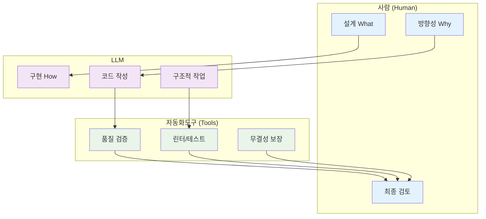
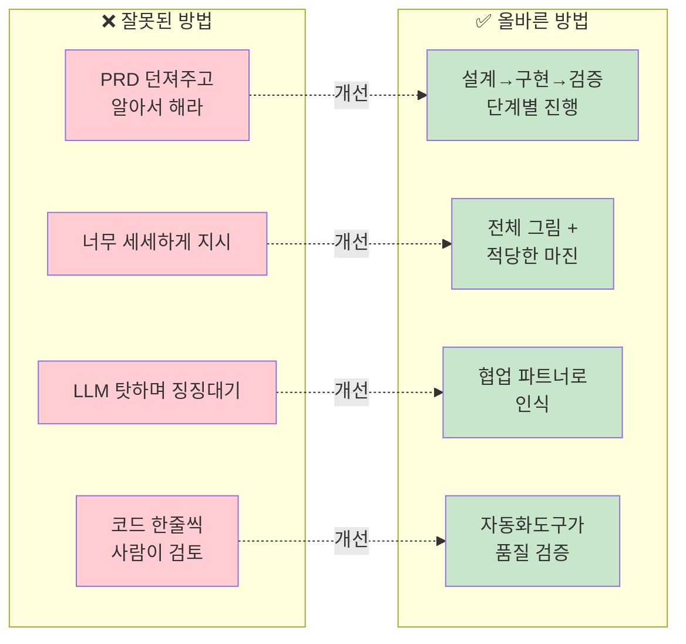

# ROOT-001: R&R을 명확하게 하라

## 핵심 포인트

**LLM과 작업할 때 가장 중요한 건 누가 뭘 하는지 확실하게 정하는 거다.**
경험상 역할이 애매하면 LLM이 설계부터 구현까지 다 하려고 들면서 엉뚱한 방향으로 간다. 그렇다고 너무 빡빡하게 틀어막으면 창의적인 부분까지 죽어버리니까, 큰 그림만 잡고 디테일은 어느 정도 여유를 줘야 한다.

### 올바른 협업 구조

### 접근법 비교

## 경험 스토리

### 문제 상황

PRD로 큰 기능 하나를 LLM에게 요청했다. 내 플랫폼의 세부 사항을 다 적어서 완벽한 요구사항 문서를 만들어줬으니, 이제 LLM이 알아서 잘 만들어주겠지 싶었다.

### 시행착오

처음에는 LLM이 만든다고는 하는데, 얼마 지나니까 내 기술 요구조건과 전혀 상관없는 걸 만들기 시작했다. 나한테 검토도 안 받고 막 만드는데, 전혀 상관없는 내용도 만들기 시작하고, 엎친 데 덮친 격으로 만든 건 돌아가지도 않았다. 거기다가 내가 전에 만들었던 코드까지 망가뜨려놓았다.

그때는 LLM 탓만 했다. "이놈이 구현을 잘못한다", "내 코드를 망가뜨렸다", "로직을 잘못 짠다" 이런 식으로 징징댔다. 하지만 문제는 LLM이 아니었다.

가장 먼저는 LLM이 구현을 잘못한다고 징징댔다. 내 코드를 망가뜨렸다부터 해서 로직을 잘못 짠다 등... 어떻게 협업해야 하는지를 모르니까. 결국은 이게 기계긴 하지만 사람과 협업하는 거랑 같은 거거든. 정확하게 정보를 주고 정책을 지정해주지 않으면 사람이나 LLM이나 마찬가지로 어려운 거지.

### 깨달음의 순간

완전히 망가진 프로젝트를 보면서 깨달았다. 이건 LLM이 못해서가 아니라, 내가 협업하는 방법을 몰랐기 때문이었다.

그때 명확한 기준이 생겼다: **사람이 설계하고 사람이 검토해야겠다.** 그리고 사람이 검증해야 하는데 코드를 라인바이라인으로 읽으면서 검증할 수는 없으니까, 검증은 자동화 도구에게 가능한 전부 위임해야겠다고 생각했다.

그리고 가장 흔하게 하는 실수는 너무 구체적으로 한다는 거야. LLM은 너무 구체적인 행동지침을 따를 수 있을 정도로 똑똑하지 않아. 그래서 마진을 줘야 해. 너무 타이트한 시스템이 아니라 전체적인 그림은 있지만 루즐리하게 따라가면서 진행할 수 있는 정도의 시스템이 좋아.

### 실제 적용

새로운 방식으로 접근했다. 프로젝트를 시작할 때 설계는 사람이 진행한다. 정확히는 시간을 아끼기 위해서 LLM과 대화형으로 필요한 요구사항을 정리한다. 그러면 LLM이 그걸 기반으로 구현하고, 구현한 내용은 린터, 포맷터, 테스트 등 자동화도구로 검증해서 무결성을 입증하는 프로세스로 작업한다.

이렇게 바꾸고 나니 LLM이 예측 가능해졌다. 더 이상 멋대로 날뛰지 않고, 내가 원하는 범위 안에서 제대로 된 결과물을 만들어냈다.

## 실제 적용 방법

### 인식 신호

다음 신호들이 보이면 R&R을 명확히 해야 할 때다:

- LLM이 요청하지 않은 기능을 추가로 만들기 시작할 때
- 구현한 코드가 동작하지 않는 일이 반복될 때
- 기존 코드가 자꾸 망가질 때
- 프로젝트 진행 방향을 예측할 수 없을 때
- LLM 결과물에 대해 "왜 이렇게 했지?" 하는 생각이 들 때

### 구체적 적용

#### 1. 역할 정의하기

**사람의 책임:**

- 전체 그림 설계 (What)
- 방향성 결정 (Why)
- 최종 검토
- 의사결정

**LLM의 책임:**

- 구체적 구현 (How)
- 코드 작성
- 명확한 가이드와 구조 위에서의 작업
- 마진 범위 내 자유도

**자동화도구의 책임:**

- 코드 품질 검증
- 린터/포맷터 실행
- 테스트 수행
- 무결성 보장

#### 2. 프로세스 수립

설계 → 대화형 정리 → 구현 → 자동검증 → 검토

#### 3. 경계선 명확화

각 단계에서 누가 무엇에 대해 책임지는지 명시:

- **설계**: 사람이 요구사항과 전체 구조 결정
- **구현**: LLM이 코드 작성과 로직 구현
- **검증**: 자동화도구가 품질과 표준 준수 확인
- **검토**: 사람이 최종 승인과 방향성 확인

### 주의사항

**하지 말아야 할 것들:**

- **너무 구체적인 지시**: LLM은 세세한 행동지침을 따를 정도로 똑똑하지 않다
- **타이트한 통제**: 너무 엄격하게 통제하려다가 오히려 망치는 경우가 많다
- **도구로 취급**: LLM을 단순한 도구로 보지 말고 협업 파트너로 접근해야 한다

**해야 할 것들:**

- **적당한 마진 제공**: 작업 기준 문서와 전체 그림은 제공하되 구현 방법에는 여유를 둬야 한다
- **루즐리한 가이드**: 너무 타이트한 시스템이 아니라 전체적인 그림은 있지만 루즐리하게 따라갈 수 있는 정도가 좋다
- **협업 마인드**: 함께 더 좋은 결과를 만든다는 관점으로 접근한다

## 왜 중요한가

이 원리를 모르면 LLM과의 협업에서 끝없는 삽질을 하게 된다. 내가 겪었던 것처럼 1달간 작업한 코드를 통째로 롤백해야 하는 절망적인 상황이 반복된다.

가장 큰 문제는 시간과 에너지 낭비다. LLM이 잘못했다고 징징대면서 같은 실수를 반복하게 되고, 결국 LLM의 생산성 이점을 전혀 누리지 못하게 된다. 오히려 혼자 작업하는 것보다 더 비효율적이 될 수도 있다.

구체적으로 R&R 없이 작업하면:

- **예측 불가능한 결과**: 매번 다른 결과가 나와서 신뢰할 수 없다
- **디버깅 시간 폭증**: 개발시간의 80% 이상이 문제 해결에 소모된다
- **반복 작업**: 같은 일을 3-5번씩 다시 해야 한다
- **높은 스트레스**: 언제 또 망할지 모르는 불안감
- **생산성 하락**: 혼자 하는 것보다 못한 결과

반면 R&R을 제대로 정립하면 LLM을 예측 가능한 개발 파트너로 만들 수 있다. 사람은 창의적 사고와 의사결정에 집중하고, LLM은 구현에 집중하고, 자동화도구는 품질 관리에 집중하는 효율적인 협업 체계가 완성된다.

결과적으로:

- **개발 속도 3-5배 향상**: 방향성 잡힌 상태에서의 빠른 구현
- **안정적인 품질**: 자동화도구가 품질을 보장
- **효율적인 협업**: 각자 역할에 집중하는 체계
- **예측 가능한 결과**: 더 이상 랜덤하지 않은 안정적 협업

이 원리 하나만 제대로 적용해도 LLM을 예측 불가능한 트러블메이커에서 신뢰할 수 있는 개발 파트너로 완전히 바꿀 수 있다.
