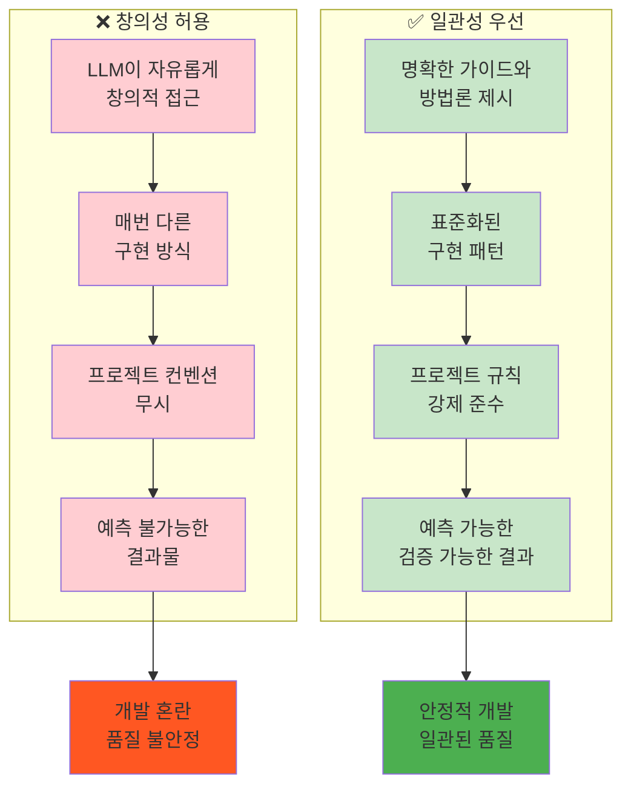
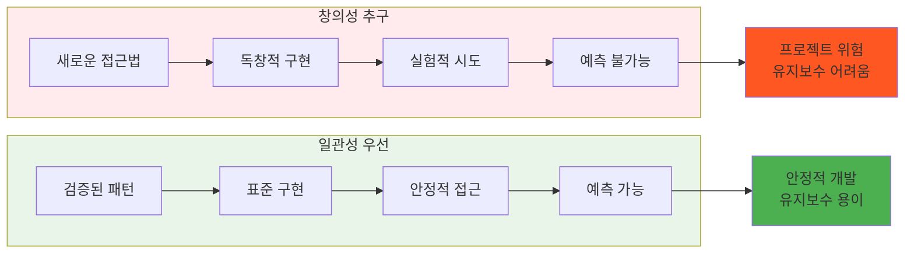

# ROOT-013: 일관성을 창의성보다 우선하라

## 핵심 포인트

**LLM에게 창의성을 허락하면 안 된다. 명확한 가이드와 방법론을 통해서 결과물을 예측 가능하고 검증 가능하게 만들어야 한다.**
펜시하거나 신박한 것은 필요 없다. 일관적이고 잘 돌아가는 코드를 만들게 해야 한다.

## 경험 스토리

### 문제 상황

LLM이 창의적으로 개발을 하도록 허용했더니 예측할 수 없는 결과가 계속 나왔다. 로그인 기능을 만들어달라고 했는데 갑자기 혼자 오버엔지니어링해서 어드민 페이지를 만들어버리는 일이 자주 발생했다.

더 심각한 문제는 프로젝트 컨벤션을 완전히 무시하는 것이었다. React Router를 사용해서 서버사이드로 동작하는 환경에서 API 라우터 대신 로더와 액션을 사용해야 하는데, LLM이 이런 프로젝트 규칙을 무시하고 "더 좋다고 생각하는" 방식으로 개발해서 코드가 아예 동작하지 않는 상황이 반복됐다.

### 시행착오

처음에는 "LLM이 똑똑하니까 더 좋은 방법을 찾아줄 거야"라고 생각했다. 창의성을 발휘해서 더 효율적이고 멋진 코드를 만들어줄 것을 기대했다.

하지만 결과는 참담했다. LLM이 "창의적으로" 만든 코드는 프로젝트 구조와 맞지 않아서 동작하지 않았고, 팀의 코딩 스타일과 전혀 다른 패턴을 사용해서 유지보수가 불가능했다. 무엇보다 매번 다른 방식으로 접근해서 일관성이 전혀 없었다.

### 깨달음의 순간

핵심 깨달음은 **"창의성은 혼란이고, 일관성이 품질이다"**라는 것이었다.

1달간의 작업을 롤백하는 절망적인 경험을 겪고 나서야 깨달았다. LLM의 창의성이 아니라 **예측 가능하고 일관된 결과**가 필요하다는 것을. 프로덕션 레벨에서는 "신박한" 코드보다 **"잘 돌아가는" 코드**가 훨씬 중요하다.

### 실제 적용

**창의성 제한 시스템을 구축했다:**



**창의성 vs 일관성 비교:**



**핵심 개선 결과:**

- **예측 가능한 결과**: 매번 같은 방식으로 일관되게 구현
- **프로젝트 규칙 준수**: 컨벤션을 강제로 따르도록 제한
- **유지보수성 향상**: 표준화된 패턴으로 가독성과 유지보수성 확보
- **품질 안정화**: 검증된 방법만 사용해서 품질 일관성 확보

## 실제 적용 방법

### 인식 신호

다음 신호들이 보이면 창의성을 제한하고 일관성을 강화해야 할 때다:

- LLM이 매번 다른 방식으로 같은 작업을 수행할 때
- 프로젝트 컨벤션과 다른 "더 좋은" 방법을 제안할 때
- 요구사항보다 복잡하고 "혁신적인" 구현을 시도할 때
- 검증되지 않은 새로운 패턴을 사용하려고 할 때
- 결과물이 예측하기 어려워질 때

### 구체적 적용

#### 1. 명확한 가이드라인 설정

**구현 방식 제한:**

- 사용할 패턴과 라이브러리 명시
- 금지할 접근법과 기술 명시
- 프로젝트 컨벤션 강제 적용
- 코딩 스타일 가이드 준수

**예시 지침:**

```
✅ 허용: React Router의 loader/action 패턴
❌ 금지: API 라우터나 별도 API 엔드포인트
✅ 허용: 기존 컴포넌트 패턴 따라하기
❌ 금지: 새로운 아키텍처나 패턴 도입
```

#### 2. 표준화된 프로세스

**일관성 확보 방법:**

- 템플릿과 보일러플레이트 활용
- 코드 리뷰 체크리스트로 검증
- 자동화된 린팅과 포맷팅 도구
- 프로젝트 문서화와 가이드 참조

#### 3. 창의성 억제 메커니즘

**제한 방식:**

- "더 좋은 방법" 제안 금지
- 요구사항 범위 외 기능 추가 금지
- 검증되지 않은 실험적 접근 금지
- 기존 패턴과 다른 구현 금지

### 주의사항

**하지 말아야 할 것들:**

- **과도한 자유도 부여**: "자유롭게 구현해줘"라는 식의 모호한 지시
- **새로운 시도 권장**: "더 좋은 방법이 있으면 써도 돼"라는 열린 접근
- **예외 허용**: "특별한 경우에만"이라는 애매한 예외 조건

**해야 할 것들:**

- **명확한 제약 조건**: 구체적이고 측정 가능한 제한 사항 제시
- **표준 패턴 강요**: 프로젝트에서 검증된 방식만 허용
- **일관성 검증**: 결과물이 기존 코드와 일치하는지 반드시 확인

## 왜 중요한가

이 원리 없이는 LLM의 창의성이 오히려 개발 품질을 해치고 프로젝트를 혼란에 빠뜨린다.

구체적으로 일관성을 우선하지 않으면:

- **예측 불가능성**: 같은 요청에도 매번 다른 결과물이 나옴
- **컨벤션 무시**: 프로젝트 규칙을 무시한 "창의적" 구현으로 코드 동작 안 함
- **유지보수 불가**: 각기 다른 패턴으로 구현된 코드의 일관성 없음
- **품질 불안정**: 검증되지 않은 실험적 접근으로 버그와 문제 증가
- **개발 혼란**: 팀원들이 각기 다른 방식에 혼란스러워함

반면 일관성을 우선하면:

- **예측 가능성**: 항상 같은 방식으로 구현되어 결과 예측 가능
- **규칙 준수**: 프로젝트 컨벤션을 따라 코드가 정상 동작
- **유지보수성**: 표준화된 패턴으로 누구나 이해하고 수정 가능
- **품질 안정**: 검증된 방법만 사용해서 안정적이고 일관된 품질
- **개발 효율**: 팀 전체가 같은 패턴으로 일해서 협업 효율 극대화

결과적으로 LLM을 "창의적인 파트너"가 아닌 **"일관된 실행자"**로 만들 수 있다. 프로덕션 레벨에서 요구되는 높은 수준의 일관성과 품질을 유지하면서도, LLM의 생산성 이점을 안전하게 활용할 수 있는 개발 환경이 구축된다.
