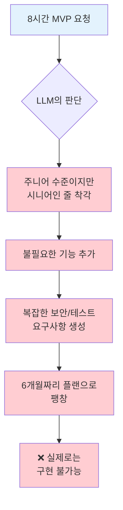
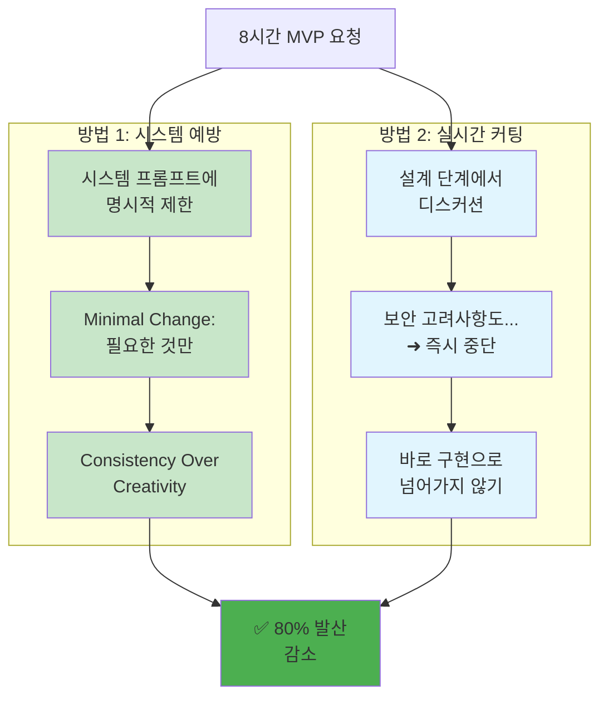

# ROOT-003: 꼭 필요한 것만 하게 하라

## 핵심 포인트

**LLM은 주니어 수준이면서 시니어인 줄 알고 오버엔지니어링하는 경향이 있다.**
8시간짜리 작업을 6개월 프로젝트로 만드는 발산을 방지하려면, 시스템적으로 범위를 제한하고 실시간으로 커팅해야 한다.

## 경험 스토리

### 문제 상황

8시간짜리 MVP 플랫폼 기능을 구현해달라고 했는데, LLM이 막 혼자 오버하더니 나중에 결과값으로 뽑아낸 플랜은 6개월짜리 플랜이 돼있었다. 뭔가 있어보이는 말들로 도배된 별 쓸데없는 기능까지 다 들어간 설계문서와 구현 플랜이 돼버렸다.

보안부터 해서 불필요한 테스트, 검증까지... 정작 LLM 자신도 만들 수 없으면서 할 수 있는 것처럼 그럴듯한 플랜만 뚝딱 만들어냈다. 내가 요청한 건 1인데 지는 주니어 엔지니어 수준이면서 지가 시니어인 줄 알고 말도 안 되는 기능 요구조건까지 끌어와서 지가 막 만드는 거였다. 당연히 필요없는 기능이고 당연히 안 돌아가는 결과만 나왔다.

### 시행착오

아주 초창기에 내가 웹개발 도메인에 지식이 하나도 없을 때는 속아봤다. "아 LLM이 전문가니까 이런 것도 필요한가보다" 하면서 따라갔는데 전부 개구라더라.

처음에는 매번 "간단하게만 해줘", "복잡하게 하지 마" 이런 식으로 말로만 제지하려고 했다. 하지만 이런 식으로는 한계가 있었다. 대화가 길어지면 또 오버엔지니어링을 시작했고, 새로운 대화에서는 또 같은 실수를 반복했다.

### 깨달음의 순간

"아, 이놈은 잡아두지 않으면 적당히를 모르는구나" - 이 깨달음이 전환점이었다. LLM의 오버엔지니어링은 우연이 아니라 근본적인 특성이라는 걸 인정하게 됐다.

그리고 더 중요한 깨달음은 바로 구현으로 들어가지 않고 명확한 요구조건을 정의하고 가면 이 부분에서 디스커션하면서 잡을 수 있다는 것이었다. 구현 단계에서 잡으려면 이미 늦고, 설계 단계에서 미리 발산을 차단해야 한다는 걸 깨달았다.

### 실제 적용

두 가지 방법을 시스템적으로 적용하기 시작했다.

**오버엔지니어링 발생 과정:**

**해결 방법:**

**1. 시스템 프롬프트에 예방책 명시**

모든 대화창이 참조하는 시스템 프롬프트에 해당 내용을 명시적으로 작성해서 못하게 막았다. 특히 "Minimal Change: Make only necessary changes, nothing more"와 "Consistency Over Creativity: Follow established patterns rather than creative solutions" 같은 원칙을 박아넣었다.

**2. 실시간 커팅**

작업 중간에 "워워" 하면서 설계하게 하는 방법이다. LLM이 "보안 고려사항도 추가해야겠고..." 이런 말이 나오기 시작하면 바로 끊어버린다. 바로 구현으로 하지 않고 명확한 요구조건을 정의하고 가니까 이 부분에서 디스커션하면서 잡을 수 있다.

이렇게 바꾸고 나니 물론 항상 그런 건 아니지만 빈도수가 80프로는 줄었다. 그리고 내도 그 컨셉을 가지고 개발하니까 내가 빠른 타이밍에 커팅이 가능한 것도 있다.

## 실제 적용 방법

### 인식 신호

다음 신호들이 보이면 LLM이 발산하기 시작하는 때다:

- 요청한 기능보다 훨씬 복잡한 플랜이 나올 때
- "보안도 고려해야 하고...", "확장성을 위해..." 같은 부가 요소가 등장할 때
- 8시간짜리가 갑자기 6개월 프로젝트로 변신할 때
- "있어보이는 말들"로 도배된 설계문서가 나올 때
- LLM이 자신도 구현 못할 기능을 계획에 넣을 때

### 구체적 적용

#### 1. 시스템 프롬프트 설정

**필수 원칙을 시스템에 박아넣기:**

- "Minimal Change: Make only necessary changes, nothing more"
- "Consistency Over Creativity: Follow established patterns rather than creative solutions"
- 창의적 해결책보다 기존 패턴 따르기
- 요청받지 않은 기능은 절대 추가하지 않기

#### 2. 설계 단계에서의 실시간 커팅

**디스커션 단계에서 잡기:**

- 구현 전에 반드시 요구조건을 명확히 정의
- LLM이 부가 기능을 제안하면 즉시 "워워" 하고 제동
- "이건 지금 필요한 게 아니야" 하고 쳐내기
- 구현 들어가면 이미 늦음

#### 3. 범위 제한 기법

**명확한 경계선 설정:**

- 시간 기반 제한: "8시간 안에 끝낼 수 있는 것만"
- 기능 기반 제한: "로그인만, 다른 기능은 나중에"
- 복잡도 기반 제한: "MVP 수준으로만"

### 주의사항

**하지 말아야 할 것들:**

- **말로만 제지**: "간단하게 해줘"로는 효과 없다
- **구현 단계에서 잡기**: 이미 늦었다
- **LLM 능력 과신**: 주니어 수준임을 항상 기억하라

**해야 할 것들:**

- **시스템적 예방**: 시스템 프롬프트에 명시적 제한
- **설계 단계 커팅**: 요구조건 정의할 때 실시간 차단
- **지속적 감시**: 80% 효과를 유지하려면 계속 관리 필요

## 왜 중요한가

이 원리를 모르면 LLM과 함께하는 모든 프로젝트가 헬게이트가 된다.

구체적으로 LLM의 발산을 막지 않으면:

- **시간 낭비**: 8시간 작업이 6개월 프로젝트로 변신
- **구현 불가능**: LLM도 만들 수 없는 복잡한 설계만 양산
- **프로젝트 실패**: 과도한 복잡성으로 인한 개발 중단
- **신뢰도 하락**: 매번 다른 결과로 협업 불가능
- **개발자 스트레스**: 끝없는 요구사항 변경과 복잡성 증가

반면 꼭 필요한 것만 하게 만들면:

- **예측 가능한 개발**: 계획한 시간 안에 완료
- **구현 가능한 설계**: 실제로 돌아가는 결과물
- **점진적 발전**: 단순한 것부터 차근차근 확장
- **효율적 협업**: 범위가 명확한 안정적 작업
- **성공 경험 축적**: 작은 성공들이 쌓여서 큰 프로젝트 가능

결과적으로 LLM을 "되는 것만 하는 실용적 파트너"로 만들 수 있다. 화려한 계획보다 실제로 동작하는 결과물을 만드는 효율적인 개발이 가능해진다.
