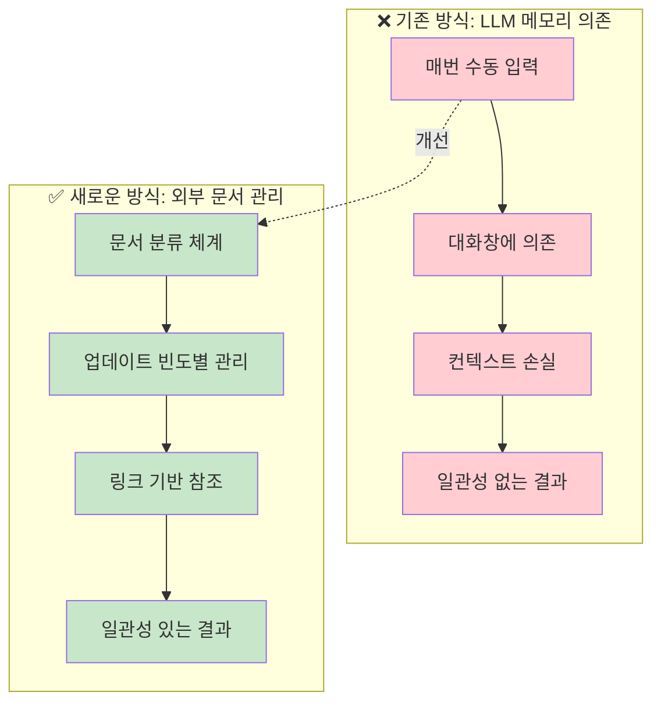
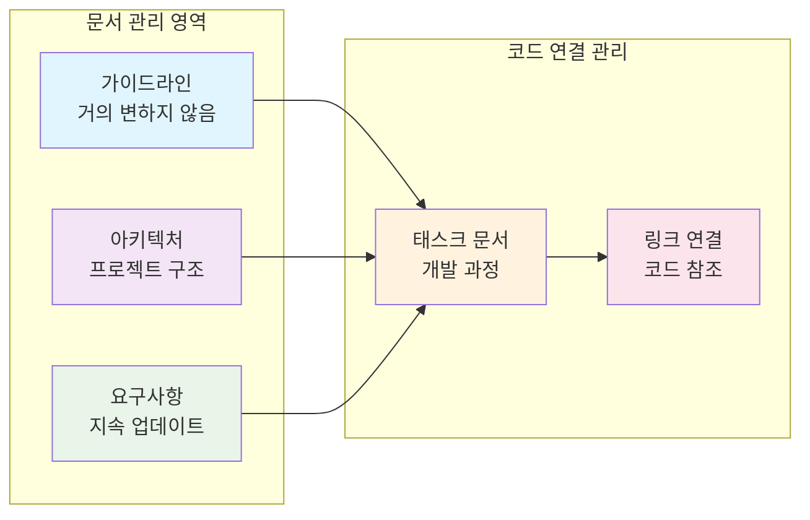

# ROOT-002: 명시적으로 컨텍스트 관리를 하라

## 핵심 포인트

**LLM과 작업할 때 컨텍스트는 반드시 외부 문서로 관리해야 한다.**
LLM의 메모리에 맡기면 대화창이 꺼지거나 대화량이 많아졌을 때 컨텍스트가 날아가면서 매번 다른 결과가 나온다.

## 경험 스토리

### 문제 상황

LLM과 프로젝트를 진행하다 보면 처음에는 잘하다가 어느 순간부터 완전히 다른 결과를 내기 시작하는 일이 반복됐다. 특히 10만 줄이 넘어가는 규모의 프로젝트에서는 맥락이 점점 희미해지면서 원래 방향을 완전히 잃어버리는 패턴이 명확했다.

가장 대표적인 예가 React Router 환경에서 로더/액션 패턴을 써야 하는데, LLM이 중간에 이 컨벤션을 완전히 잊어버리고 API 라우터로 개발해서 코드가 아예 동작하지 않는 상황이었다. 처음엔 분명히 내 요구사항을 정확히 이해했는데 말이다.

### 시행착오

처음에는 매번 맥락을 재입력하고 작업 내용을 일일이 모두 명시해주려고 했다. 코딩 가이드라인부터 프로젝트 요구사항까지 매번 찾아서 타이핑했다.

하지만 이건 정말 손도 아프고 시간도 아까웠다. 나도 사람이기 때문에 매번 모든 걸 기억해서 적는다는 건 말이 안 됐다. 그리고 결과를 보면서 내가 생각한 기준을 하나씩 이야기하다 보면 지쳐서 때려치게 되는 경우가 많았다.

결국 이 방법은 근본적인 한계가 있었다. 입력하는 소스의 품질이 들쭉날쭉하니 LLM의 결과도 들쭉날쭉했고, 특히 중간에 맥락이 손실되면 아예 다른 결과가 나왔다.

### 깨달음의 순간

1달간 작업을 롤백하는 절망적인 경험을 겪고 나서 깨달았다. LLM의 메모리 한계를 인정하고, 모든 정보를 매번 입력하는 대신 중복되고 반복적으로 사용되는 내용을 효과적으로 문서화하는 시스템이 필요하다는 걸.

소프트웨어 아키텍트로서 원래 하던 가이드라인과 기준 문서 만드는 것과 하나도 다를 게 없다는 걸 깨달았다. 오히려 지금은 LLM이 있으니까 일관적인 기준만 잘 잡으면 문서를 매우 빠르게 만들고 관리할 수 있어서 더 좋았다.

### 실제 적용

문서로 관리할 수 있는 부분과 코드로 관리할 수 있는 부분을 나눴다.

**컨텍스트 관리 시스템:**

**문서 분류 체계:**

이렇게 바꾸고 나니 모든 개발에 필요한 내용이 문서로 관리되고, 매번 작업하면서 문서를 업데이트할 수 있게 됐다. 매번 컨텍스트 관리를 위해 전전긍긍하는 게 아니라, 컨텍스트를 익히게 하기 위해서 해당 문서들을 한 번씩 읽으라고 하면 되고, 디테일하게 필요한 경우는 그 문서 중의 특정 문서를 링크 한 번 걸면 됐다.

## 실제 적용 방법

### 인식 신호

다음 신호들이 보이면 컨텍스트 관리를 도입해야 할 때다:

- LLM이 처음에는 잘하다가 갑자기 다른 결과를 내놓을 때
- 프로젝트 컨벤션을 자꾸 무시하는 코드가 나올 때
- 매번 같은 설명을 반복해서 타이핑하고 있을 때
- 대화창을 닫는 게 두려울 때
- 컴팩트나 컨텍스트 비우기를 자주 사용할 때

### 구체적 적용

#### 1. 문서 분류 체계 구축

**업데이트 빈도별 분류:**

- 가이드라인: 거의 변하지 않는 보편적 기준
- 아키텍처: 프로젝트 구조와 설계 원칙
- 요구사항: 사람-AI 디스커션으로 지속 업데이트되는 설계
- 태스크: 개발 과정의 구체적 작업 내용

#### 2. 점진적 문서화

너무 많은 걸 한 번에 하지 말고, 작업하면서 필요하다고 느끼는 걸 하나씩 문서로 정리한다.

#### 3. 문서 컨셉과 구조 고정

일관된 문서 구조를 만들어서 고정시키는 게 매우 중요하다. 이래야 LLM이 예측 가능하게 정보를 찾을 수 있다.

#### 4. 링크 기반 참조 시스템

디테일한 내용이 필요할 때는 특정 문서를 링크로 연결해서 즉시 참조할 수 있게 한다.

### 주의사항

**하지 말아야 할 것들:**

- **완벽주의**: 처음부터 모든 걸 문서화하려고 하지 마라
- **메모리 의존**: 클로드 컴팩트나 컨텍스트 비우기로 해결하려 하지 마라
- **일회성 입력**: 매번 타이핑해서 맥락을 전달하려 하지 마라

**해야 할 것들:**

- **필요 기반**: 작업하면서 실제 필요한 것부터 문서화
- **구조화**: 일관된 문서 구조와 컨셉 유지
- **지속 관리**: 작업과 함께 문서도 지속적으로 업데이트

## 왜 중요한가

이 원리를 모르면 LLM과 함께 작업할 때 끝없는 비효율에 시달리게 된다.

구체적으로 컨텍스트를 외부 관리하지 않으면:

- **예측 불가능한 결과**: 매번 다른 결과가 나와서 신뢰할 수 없다
- **반복 작업**: 같은 설명을 매번 타이핑해야 한다
- **대화창 의존**: 대화창이 꺼지는 게 두려워서 작업이 위축된다
- **중간 개입 증가**: 원하는 방향으로 가지 않아서 계속 수정해야 한다
- **시간 낭비**: 매번 씨부렁씨부렁하면서 같은 문제를 반복한다

반면 컨텍스트를 제대로 외부 관리하면:

- **일관성 보장**: 언제나 예측 가능한 결과
- **작업 속도 향상**: 체감상 90% 이상 빨라짐
- **대화창 자유**: 대화창 종료가 전혀 두렵지 않음
- **타자량 감소**: 반복 입력이 대폭 줄어듦
- **자동화된 품질**: LLM이 일관된 기준으로 자동 작업

결과적으로 LLM을 진짜 협업 파트너로 만들 수 있다. 내가 "왜"와 "무엇"에만 집중하고, "어떻게"는 시스템이 알아서 처리하는 효율적인 협업이 가능해진다.
