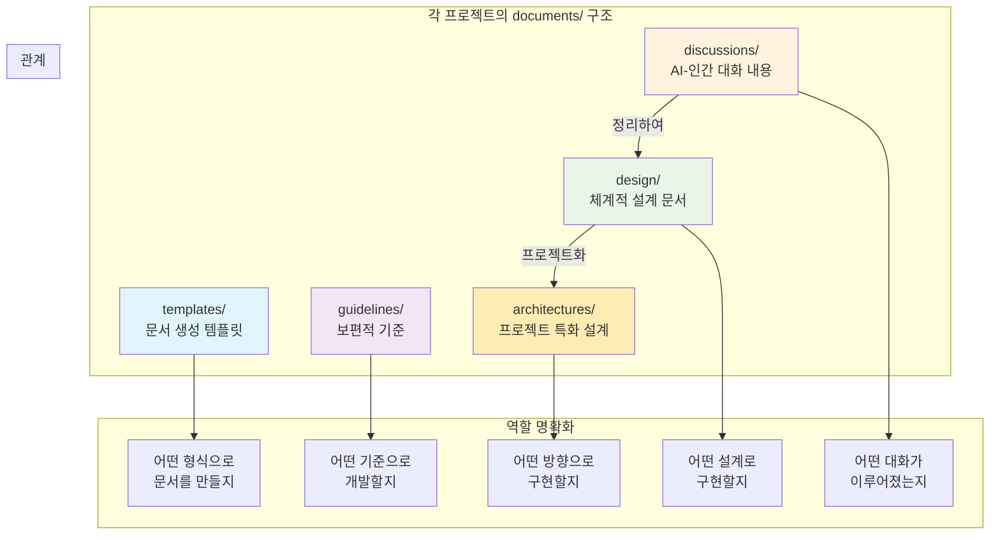
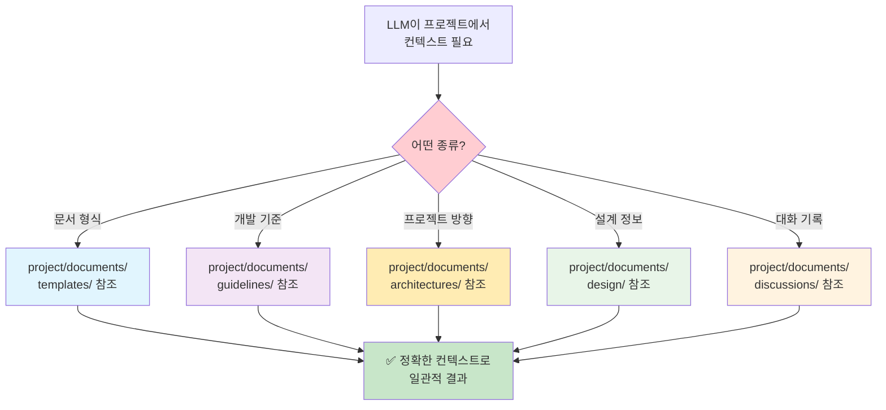
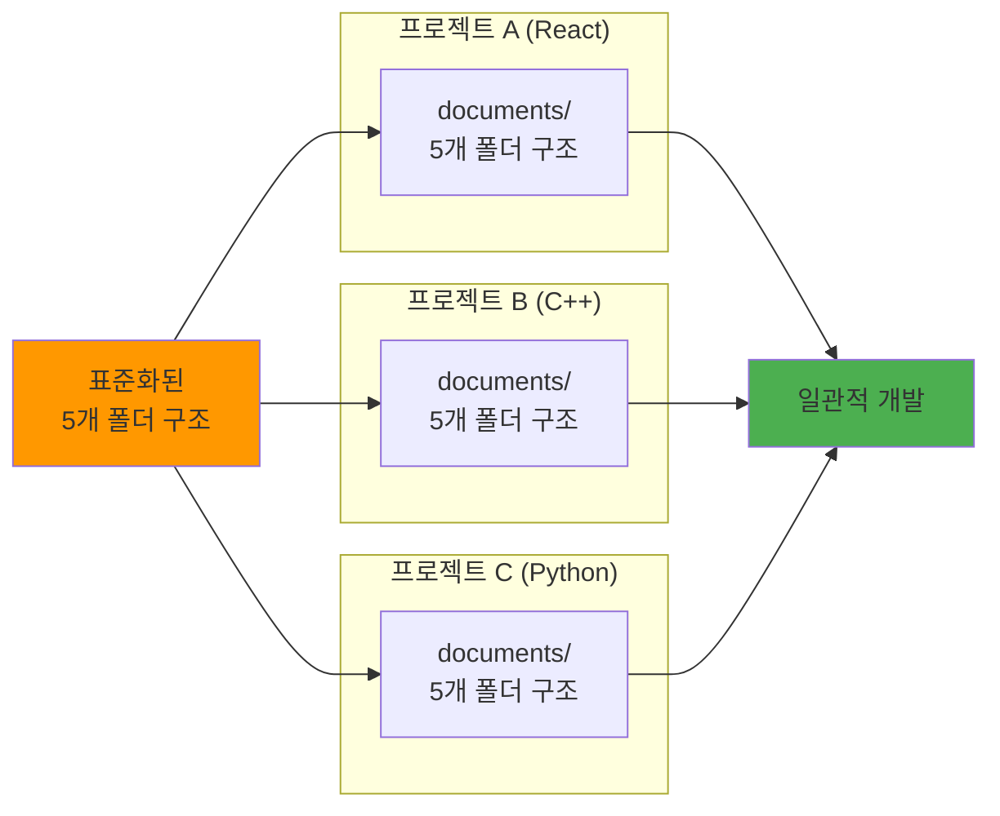

# ROOT-007: 구조를 통해 역할을 명확하게 하라

## 핵심 포인트

**LLM은 컨텍스트 싸움이다. 레퍼런스 문서들도 구조를 통해 역할을 명확하게 하지 않으면 발산한다.**
레이어를 나누는 것만으로는 부족하다. 입력값이 발산값이면 출력값이 좋을 수 없기 때문에, 명확한 인덱싱을 위해 구조를 나누어야 한다.

## 경험 스토리

### 문제 상황

6번 원리에서 추상화를 통해 레이어를 나눴지만, 그것만으로는 충분하지 않았다. LLM은 결국 컨텍스트 싸움인데, 레퍼런스 문서들의 구조와 책임이 명확하지 않으면 근본적인 문제가 발생했다.

작성하는 사람이 문서를 어디에 어떻게 넣어야 할지 애매하니까 제멋대로 만들기 시작했고, LLM도 애매한 분류와 구조 때문에 결국 발산하기 시작하는 것이었다.

### 시행착오

처음에는 단순히 폴더만 나누면 될 줄 알았다. 하지만 각 폴더의 역할이 명확하지 않으니 같은 내용이 여러 곳에 중복되거나, 어디에 넣어야 할지 애매한 문서들이 계속 생겼다.

특히 LLM이 참조할 때도 어떤 문서를 언제 참조해야 하는지 기준이 없으니, 필요한 컨텍스트를 놓치거나 불필요한 정보까지 끌어와서 혼란만 가중되었다.

### 깨달음의 순간

핵심 깨달음은 **"입력값이 발산값이면 출력값이 좋을 수 없다"**는 것이었다.

아무리 LLM이 똑똑해도, 애매하고 중구난방인 레퍼런스를 주면 결과도 애매하고 중구난방이 될 수밖에 없었다. 명확한 인덱싱을 위해서는 각 구조가 명확한 역할을 가져야 한다는 걸 깨달았다.

### 실제 적용

**각 프로젝트의 documents/ 구조를 다음 5개 폴더로 역할별 명확하게 분리했다:**

**명확한 인덱싱 시스템:**

**핵심 혁신: 표준화된 프로젝트 구조**

이 5개 폴더 구조를 모든 프로젝트에서 동일하게 사용하기 때문에 언어나 도메인에 상관없이 일관적인 개발과 컨텍스트 입력을 유지할 수 있게 됐다.

## 실제 적용 방법

### 인식 신호

다음 신호들이 보이면 구조적 역할 명확화가 필요할 때다:

- 같은 종류의 문서가 여러 곳에 중복될 때
- 새로운 문서를 어디에 넣어야 할지 애매할 때
- LLM이 필요한 컨텍스트를 찾지 못하거나 잘못된 것을 참조할 때
- 작성자마다 다른 기준으로 문서를 만들 때
- 프로젝트별로 다른 구조를 사용해서 혼란이 있을 때

### 구체적 적용

#### 1. 구조별 명확한 역할 정의

**각 구조의 단일 책임:**

- **templates/**: "어떤 형식으로 만들지"만 담당
- **guidelines/**: "어떤 기준으로 개발할지"만 담당 (보편적 사실)
- **architectures/**: "어떤 방향으로 구현할지"만 담당 (프로젝트 종속적 방향성)
- **design/**: "어떤 설계로 구현할지"만 담당 (체계적으로 정리된 설계)
- **discussions/**: "어떤 대화가 이루어졌는지"만 담당 (AI-인간 대화의 템프)

#### 2. 명확한 분류 기준 설정

**문서 배치 결정 트리:**

1. 문서 생성 형식이라면 → templates/
2. 보편적인 개발 기준이라면 → guidelines/
3. 프로젝트 종속적인 방향성이라면 → architectures/
4. 체계적으로 정리된 설계라면 → design/
5. AI-인간 대화의 날것 기록이라면 → discussions/

#### 3. 인덱싱 시스템 구축

**LLM을 위한 명확한 참조 경로:**

- 각 구조가 언제 참조되어야 하는지 명시
- 중복 참조를 방지하는 우선순위 설정
- 빠뜨릴 수 없는 필수 참조 문서 지정

### 주의사항

**하지 말아야 할 것들:**

- **애매한 분류**: 여러 역할을 겸하는 구조는 만들지 마라
- **중복 허용**: 같은 내용이 여러 곳에 있으면 혼란만 가중된다
- **역할 변경**: 한 번 정한 구조의 역할은 함부로 바꾸지 마라

**해야 할 것들:**

- **단일 책임**: 각 구조는 하나의 명확한 역할만 가져라
- **전역 일관성**: 모든 프로젝트에서 같은 구조를 사용하라
- **명확한 인덱싱**: 언제 어떤 구조를 참조할지 기준을 명시하라

## 왜 중요한가

이 원리 없이는 아무리 좋은 컨텍스트를 만들어도 LLM이 제대로 활용할 수 없다.

구체적으로 구조적 역할 명확화를 하지 않으면:

- **입력 발산**: 애매한 문서 구조로 잘못된 컨텍스트 제공
- **출력 발산**: 잘못된 입력값으로 인한 일관성 없는 결과
- **중복과 누락**: 필요한 정보는 빠뜨리고 불필요한 정보는 중복 제공
- **프로젝트별 혼란**: 각기 다른 구조로 인한 학습 비용 증가
- **유지보수 불가**: 문서를 어디서 어떻게 관리해야 할지 애매

반면 구조를 통한 역할 명확화를 하면:

- **정확한 컨텍스트**: 필요한 때 필요한 정보만 정확히 제공
- **일관적 결과**: 구조화된 입력으로 예측 가능한 출력
- **효율적 참조**: LLM이 어떤 정보를 어디서 찾을지 명확히 인식
- **전역 일관성**: 모든 프로젝트에서 동일한 방식으로 작업 가능
- **확장 용이**: 새로운 문서도 명확한 기준으로 분류하여 추가 가능

결과적으로 LLM을 "정확한 컨텍스트를 정확히 활용하는 시스템"으로 만들 수 있다. 입력값의 품질이 보장되면 출력값의 품질도 보장되는 예측 가능한 개발이 가능해진다.
