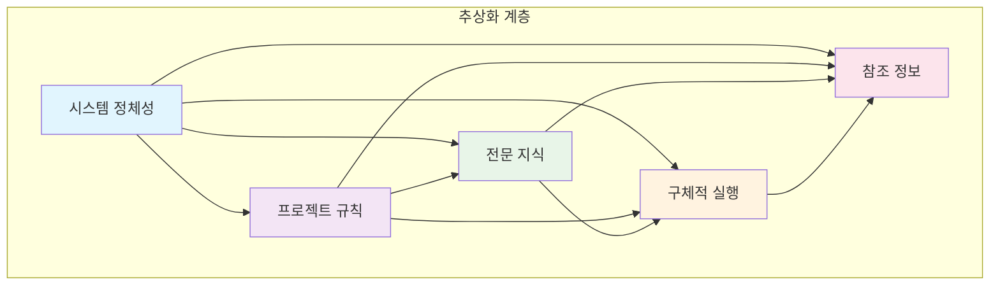
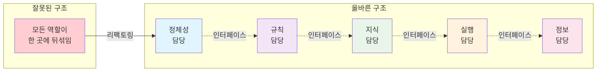

# ROOT-006: 추상화를 통해 책임영역을 명확하게 하라

## 핵심 포인트

**LLM과의 복잡한 협업에서는 각 구성요소가 자신만의 명확한 책임을 가져야 한다.**
전체 시스템을 여러 레이어로 분리하고, 각 레이어는 자신의 영역만 담당하며 다른 영역은 추상화를 통해 인터페이스로만 소통해야 한다. 이를 통해 복잡성을 관리 가능한 수준으로 분해할 수 있다.

## 경험 스토리

### 문제 상황

LLM과 복잡한 작업을 할 때 가장 큰 문제는 모든 역할이 하나로 뒤섞여 있다는 것이었다. 시스템 정책, 전문 지식, 실행 방법, 참조 정보가 모두 한 곳에 섞여서 어디서 문제가 생겼는지 파악하기 어려웠다.

하나를 바꾸려면 전체를 건드려야 했고, 비슷한 작업을 할 때도 처음부터 다시 만들어야 했다. 무엇보다 LLM이 이런 복합적인 지시를 일관성 있게 따르지 못했다.

### 시행착오

처음에는 모든 것을 하나의 큰 지시사항에 넣으려고 했다. "이것도 고려하고 저것도 하되, 이런 경우에는 다르게..." 식으로 조건과 예외사항이 계속 늘어났다.

결과는 예측할 수 없는 동작이었다. LLM은 복잡한 멀티태스킹을 일관성 있게 처리하지 못했고, 작업 중간에 우선순위가 뒤바뀌거나 중요한 부분을 놓치는 일이 빈번했다.

### 깨달음의 순간

**단일 책임 원칙**을 LLM 시스템에도 적용해야 한다는 깨달음이 왔다. 각 구성요소는 하나의 명확한 역할만 담당하고, 다른 역할에 대해서는 "어떻게 하는지"를 몰라도 "무엇을 요청하면 되는지"만 알면 되는 구조가 필요했다.

이것이 바로 **추상화를 통한 책임 분리**의 핵심이었다.

### 실제 적용

**레이어 분리의 기본 원칙을 적용했다:**

**범위별 분리:**

- 보편적인 것과 특수한 것을 분리한다
- 정책과 실행을 분리한다
- 지식과 행동을 분리한다

**책임별 분리:**

- 전체 시스템의 정체성을 담당하는 영역
- 특정 맥락의 규칙을 담당하는 영역
- 전문 지식을 담당하는 영역
- 구체적 실행을 담당하는 영역
- 참조 정보를 담당하는 영역

**추상화 적용:**

- 각 레이어는 자신의 책임 영역만 구체적으로 안다
- 다른 레이어에 대해서는 "무엇을 요청할 수 있는지"만 안다
- "어떻게 처리되는지"는 알 필요가 없다

**인터페이스 설계:**

- 레이어 간 소통은 명확한 요청-응답 구조로만 이뤄진다
- 각 레이어의 내부 구현이 바뀌어도 다른 레이어에 영향 없다
- 새로운 기능 추가가 기존 구조를 깨뜨리지 않는다

**결과:**
각 구성요소가 자신만의 명확한 역할을 가지게 됐다. 문제가 생기면 해당 레이어에서만 해결하면 되고, 새로운 기능은 적절한 레이어에 추가하기만 하면 된다. 전체 시스템의 복잡성을 개별 레이어의 단순성으로 분해할 수 있게 됐다.

**시스템 구조:**

**책임 분리 원칙:**

## 실제 적용 방법

### 인식 신호

다음 신호들이 보이면 책임영역 분리를 도입해야 할 때다:

- 하나의 지시사항이 계속 복잡해질 때
- 여러 역할이 하나에 뒤섞여서 예측하기 어려울 때
- 무엇을 어디서 수정해야 할지 판단이 서지 않을 때
- 비슷한 작업도 매번 처음부터 다시 만들어야 할 때
- LLM이 멀티태스킹에서 일관성을 잃을 때

### 구체적 적용

#### 1. 책임 영역 식별

**성격별로 구분하기:**

- 변하지 않는 것과 자주 변하는 것
- 보편적인 것과 특수한 것
- 정책을 정하는 것과 실행하는 것
- 지식을 다루는 것과 행동을 다루는 것

**각 영역의 단일 책임 정의:**

- 이 영역이 "하는 일"을 명확히 정의
- 이 영역이 "하지 않는 일"을 명확히 정의
- 다른 영역과의 경계선을 명확히 그리기

#### 2. 추상화 원칙 적용

**내부 구현 숨기기:**

- 각 영역은 자신의 내부 작동 방식만 안다
- 다른 영역의 내부는 알 필요 없다
- 오직 "무엇을 요청하면 무엇을 받는지"만 안다

**인터페이스로 소통:**

- 영역 간 소통은 명확한 요청-응답 구조
- 내부가 바뀌어도 인터페이스는 그대로 유지
- 새로운 기능이 기존 인터페이스를 깨뜨리지 않음

### 주의사항

**하지 말아야 할 것들:**

- **모든 역할을 한 곳에**: 여러 책임을 하나로 섞지 마라
- **경계를 흐리기**: "이것도 저것도" 식으로 책임을 분산시키지 마라
- **내부 구현 노출**: 한 영역이 다른 영역의 내부를 직접 건드리지 마라

**해야 할 것들:**

- **명확한 경계**: 각 영역의 역할을 분명히 정의하기
- **인터페이스 우선**: 내부 구현보다 소통 방법에 집중
- **독립성 유지**: 각 영역이 독립적으로 변경 가능하게

## 왜 중요한가

이 원리 없이는 LLM과의 복잡한 협업을 체계적으로 관리하는 것이 불가능하다.

구체적으로 책임영역을 분리하지 않으면:

- **복잡성의 폭발**: 모든 것이 얽혀서 전체를 파악할 수 없음
- **변경의 파급효과**: 하나를 바꾸면 예상치 못한 곳까지 영향
- **중복과 낭비**: 비슷한 기능을 계속 다시 만들어야 함
- **문제 추적 불가**: 어디서 잘못됐는지 찾기 어려움
- **성장의 한계**: 복잡해질수록 더 이상 확장 불가능

반면 책임영역을 제대로 분리하면:

- **관리 가능한 복잡성**: 전체를 이해 가능한 단위로 분해
- **안전한 변경**: 한 영역 수정이 다른 영역에 영향 없음
- **효율적 재사용**: 기존 구성요소를 새로운 맥락에서 활용
- **빠른 문제 해결**: 문제 영역을 신속하게 특정하고 해결
- **무한한 확장성**: 새로운 기능을 기존 구조 위에 안전하게 추가

결과적으로 LLM과의 협업을 "임시방편"에서 "체계적인 방법론"으로 전환할 수 있다. 복잡한 작업도 명확한 원칙에 따라 예측 가능하게 관리할 수 있게 된다.
