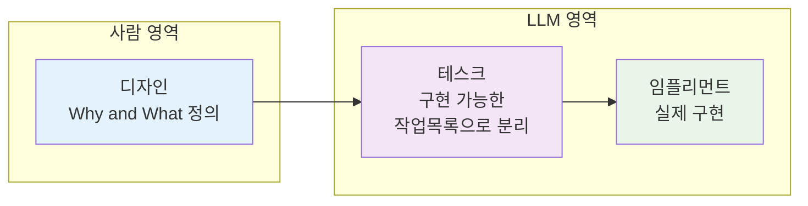
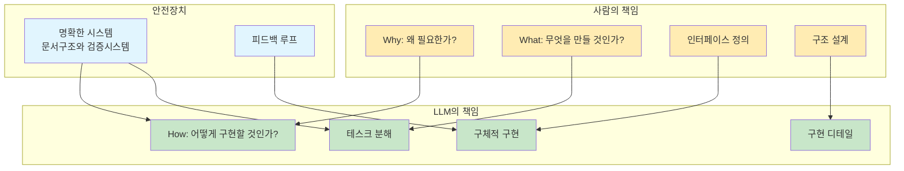
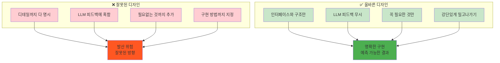

# ROOT-009: 왜(Why)와 무엇(What)만 정의하고 어떻게(How)는 위임하라

## 핵심 포인트

**사람은 요구조건과 구체적인 결과물의 형태만 명시하고, 구현 방법은 LLM에게 위임해야 한다.**
명확한 시스템이 안전장치가 되어 발산을 방지하므로, 서로의 영역을 침범하지 않고 각자 잘하는 일만 나눠서 할 수 있다.

## 경험 스토리

### 문제 상황

처음에는 LLM을 세밀하게 컨트롤하려고 했다. 모든 구현 디테일까지 사람이 지정해주려고 시도했다.

가장 먼저 멀티에이전트 시스템을 만들어봤는데, 에이전트가 에이전트를 콜하는 자동화된 시스템을 만들어보니 전혀 돌아가지 않았다.

### 시행착오

세밀한 컨트롤을 시도할수록 더 큰 문제가 발생했다. LLM은 아직 그 정도로 사람의 구체적이고 복잡한 요구조건을 따라할 수 없다는 걸 깨달았다.

복잡한 자동화 시스템을 만들려고 할수록 오히려 성능이 떨어지고, 예측 불가능한 결과만 나왔다.

### 깨달음의 순간

핵심 깨달음은 **"사람이 굳이 그렇게까지 하지 않아도 된다"**는 것이었다.

명확한 기준과 결과물만 제시할 수 있으면, LLM이 피드백 루프 안에서 알아서 만들 것이라는 생각이 들었다. 그리고 이 생각은 적중했다. 정말 잘 되더라.

### 실제 적용

**디자인-테스크-임플리먼트 3단계 과정을 도입했다:**

**명확한 역할 분담:**

**핵심 원칙: 디자인 단계의 절제**

**결과적 개선:**

- **고민 집중화**: 내가 고민해야 하는 것만 고민하게 됨
- **감정소모 감소**: 컨텍포인트가 적어져서 LLM과 일할 때 감정소모가 크게 줄어듦
- **업무 퍼포먼스 증가**: 딱 정리해야 할 거만 정리해서 넘겨주면 됨
- **개발 속도 향상**: 아주 빠르게 개발할 수 있게 됨

## 실제 적용 방법

### 인식 신호

다음 신호들이 보이면 Why/What과 How 분리가 필요할 때다:

- LLM을 세밀하게 컨트롤하려다가 복잡해질 때
- 구현 디테일까지 다 지정해주려고 할 때
- LLM이 제안하는 불필요한 기능에 혹할 때
- 멀티에이전트 자동화 시스템이 제대로 돌아가지 않을 때
- 개발할 때 감정소모가 클 때

### 구체적 적용

#### 1. 3단계 과정 구축

**1단계 - 디자인 (사람):**

- Why: 왜 이 기능이 필요한지 명확히 정의
- What: 무엇을 만들 것인지 구체적 결과물 명시
- 인터페이스와 구조만 설계
- 구현 디테일은 절대 포함하지 않기

**2단계 - 테스크 (LLM):**

- 디자인을 구현 가능한 작업목록으로 분해
- 각 테스크의 완료 조건 명시
- 테스크 간 의존성 정리

**3단계 - 임플리먼트 (LLM):**

- 실제 코드 구현
- 피드백 루프를 통한 개선
- 검증 및 테스트

#### 2. 디자인 단계의 절제 원칙

**해야 할 것:**

- 인터페이스와 구조에만 집중
- 꼭 필요한 핵심 요소만 명시
- 강단있게 필요한 것만 밀고나가기
- LLM 피드백은 과감히 무시

**하지 말아야 할 것:**

- 디테일한 구현 방법 명시
- LLM이 제안하는 부가 기능에 혹하기
- 필요없는 것까지 추가하려고 하기
- 완벽하게 모든 걸 지정하려고 하기

#### 3. 안전장치 시스템 활용

**기존 시스템 활용:**

- 문서 구조를 통한 컨텍스트 관리
- 자동화된 검증 시스템
- 명확한 역할 분담 체계
- 피드백 루프 메커니즘

### 주의사항

**하지 말아야 할 것들:**

- **과도한 컨트롤**: 모든 구현 디테일까지 지정하려 하지 마라
- **LLM 의존**: LLM의 제안을 맹목적으로 따르지 마라
- **완벽주의**: 모든 경우의 수를 다 고려하려 하지 마라

**해야 할 것들:**

- **명확한 경계**: 사람과 LLM의 역할을 명확히 구분하라
- **절제된 설계**: 인터페이스와 구조만 정의하라
- **시스템 신뢰**: 기존 안전장치 시스템을 신뢰하라

## 왜 중요한가

이 원리 없이는 LLM과의 협업에서 효율성과 예측가능성을 모두 잃는다.

구체적으로 Why/What과 How를 구분하지 않으면:

- **과도한 컨트롤 비용**: 모든 디테일을 지정하려다 오히려 더 복잡해짐
- **감정소모 증가**: 불필요한 컨텍포인트로 인한 스트레스 증가
- **개발 속도 저하**: 사람이 해야 할 일과 LLM이 해야 할 일이 뒤섞임
- **예측 불가능**: 복잡한 요구사항으로 인한 발산과 실패
- **역할 혼재**: 각자의 전문성을 제대로 활용하지 못함

반면 Why/What과 How를 명확히 구분하면:

- **효율적 분업**: 각자 잘하는 일만 집중해서 처리
- **감정소모 최소화**: 명확한 역할 분담으로 스트레스 감소
- **개발 속도 향상**: 불필요한 커뮤니케이션 비용 제거
- **예측 가능**: 명확한 기준과 안전장치로 일관적 결과
- **전문성 극대화**: 사람의 창의성과 LLM의 구현력 모두 활용

결과적으로 LLM을 "창의적 설계는 따르고 구현은 맡길 수 있는 파트너"로 만들 수 있다. 사람은 본질적 문제 해결에 집중하고, LLM은 효율적 구현에 집중하는 이상적인 협업이 가능해진다.
