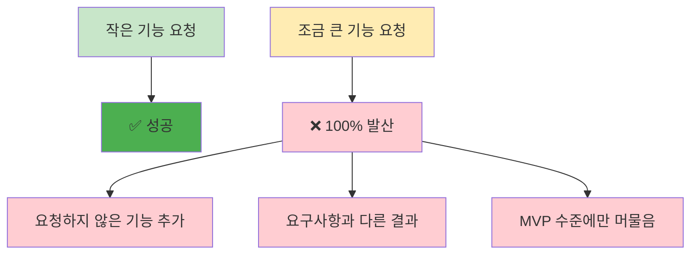
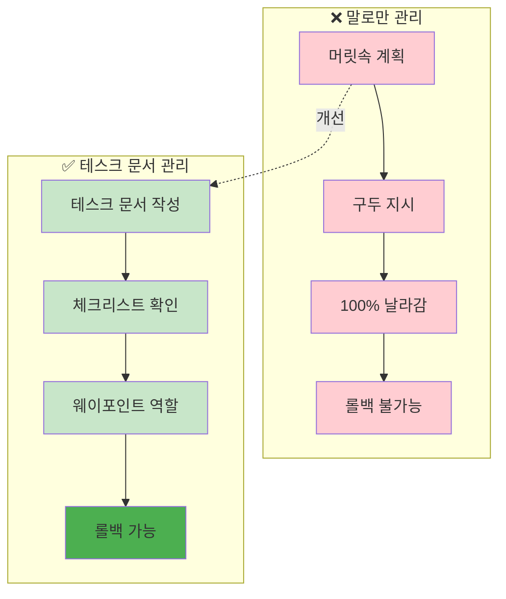
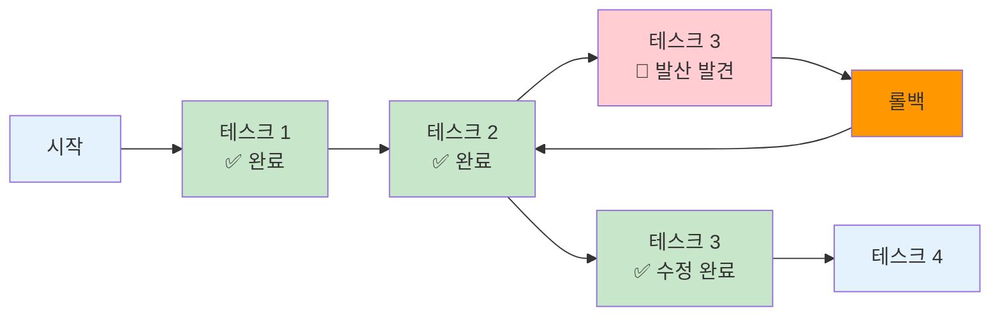

# ROOT-005: 작업과정을 명시적으로 진행하라

## 핵심 포인트

**LLM과 작업할 때는 테스크 문서와 체크리스트를 통해 명시적으로 작업 과정을 관리해야 한다.**
기능이 조금만 커져도 100% 새기 때문에, 웨이포인트 역할을 하는 문서가 없으면 롤백도 불가능하고 유지보수 가능한 상용 프로젝트는 만들 수 없다.

## 경험 스토리

### 문제 상황

LLM과 작업할 때 가장 큰 문제는 작은 기능은 괜찮지만, 조금만 기능이 커져도 100% 새는 것이었다. 무조건이었다. 그렇다고 작은 것만 하면 LLM 쓸 이유가 없어서 그냥 직접 만들고 말지 싶었다.

요청하지 않은 걸 만든다던지, 요구사항과 결과가 다르다던지 하는 경우가 가장 많았다. 이런 식으로는 MVP만 만들 수 있지, 유지보수까지 고려한 상용 프로젝트는 불가능했다.

### 시행착오

처음에는 말로만 관리하려고 했다. "이거 하고 저거 해" 식으로 지시하면서 머릿속에만 계획을 두고 작업했다. 하지만 이건 100% 날라갔다. 기능이 조금만 커져도 무조건 샜다.

말로만 관리하다 보니 LLM이 샐 때마다 어디서부터 잘못됐는지 파악하기도 어려웠고, 다시 시작하려고 해도 정확히 어떤 기준으로 작업해야 하는지 애매했다.

### 깨달음의 순간

핵심 깨달음은 **웨이포인트**의 중요성이었다. 헨젤과 그레탈의 빵조각 같은 역할이 필요하다는 걸 깨달았다.

LLM이 샐 때 테스크 문서가 있으면 롤백해서 샌 데부터 다시 따라가면서 만들 수 있다는 것이었다. 이게 정말 중요했다. 진짜 중요했다.

또한 "되는 게 중요한 게 아니라 기준에 맞게 되는 게 중요"하다는 걸 깨달았다. 되고 만족하는 건 아마추어가 하는 거고, 상용 프로젝트에서는 과정과 요구조건 만족이 매우 중요하기 때문이었다.

### 실제 적용

테스크 문서를 작성하고 체크리스트를 만들어서 각 테스크에 필요한 구체적인 사항들을 정리해놓기 시작했다. 그리고 LLM이 매번 체크리스트를 체크하면서 필요한 컨텍스트를 읽으면서 작업하게 했다.

**문제 상황 - LLM의 발산 패턴:**

**해결책 - 웨이포인트 시스템:**

**헨젤과 그레탈의 빵조각 시스템:**

**핵심 시스템:**

1. **테스크 문서 작성**: 각 작업에 필요한 구체적 사항들을 문서화
2. **체크리스트 관리**: 매번 체크하면서 기준 확인
3. **컨텍스트 연결**: 앞서 만든 문서 관리 시스템과 연계
4. **롤백 프로세스**: 잘못된 걸 발견하면 클리어하고 새 창에서 문서 컨텍스트 다시 로드

**자동화 개선:**

커맨드로 자동화해놓으면 더 좋다. 샐 때마다 수동으로 복구하는 것보다 자동으로 컨텍스트를 다시 불러오고 샌 테스크부터 재시작하는 시스템을 구축했다.

물론 이걸로도 완전하게 다른 데로 새는 걸 잡을 수는 없다. 하지만 중요한 건 웨이포인트가 되어준다는 것이었다. 새는 순간 기준이랑 달라지니까 바로 알 수 있고, 기준을 계속 반복할 수 있었다. 기준이 진짜 중요했다.

## 실제 적용 방법

### 인식 신호

다음 신호들이 보이면 명시적 작업과정 관리를 도입해야 할 때다:

- 작은 기능은 잘하는데 조금만 커지면 100% 샐 때
- 요청하지 않은 기능이 계속 추가될 때
- 요구사항과 결과가 자꾸 달라질 때
- 말로만 지시했다가 작업 방향을 잃어버릴 때
- LLM이 샜을 때 어디서부터 잘못됐는지 파악하기 어려울 때

### 구체적 적용

#### 1. 테스크 문서 시스템 구축

**테스크 문서 구성:**

- 작업 목표와 범위 명시
- 구체적 요구사항 체크리스트
- 필요한 컨텍스트 문서 링크
- 완료 기준과 검증 방법

**체크리스트 관리:**

- 각 단계별 체크포인트 설정
- 기준 충족 여부 확인 항목
- 다음 단계로 넘어가는 조건

#### 2. 웨이포인트 시스템

**롤백 프로세스:**

1. 잘못된 것을 발견하는 순간 즉시 중단
2. 대화창 클리어 또는 새 창 열기
3. 문서 컨텍스트 다시 로드
4. 샌 테스크부터 다시 시작

**자동화된 복구:**

- 컨텍스트 재로드 커맨드
- 특정 테스크부터 재시작 커맨드
- 기준 문서 자동 참조 시스템

#### 3. 기준 중심 관리

**상용 프로젝트 기준:**

- "되는 것"이 아닌 "기준에 맞게 되는 것" 추구
- 과정과 요구조건 만족을 최우선
- 유지보수 가능성까지 고려한 체계적 접근

### 주의사항

**하지 말아야 할 것들:**

- **말로만 관리**: 100% 날라간다
- **완벽한 방지 기대**: 완전하게 새는 걸 잡을 수는 없다
- **MVP 수준 만족**: 아마추어 방식이다

**해야 할 것들:**

- **문서화된 웨이포인트**: 헨젤과 그레탈의 빵조각 역할
- **즉시 롤백**: 샌 순간 바로 인식하고 복구
- **기준 중심**: 되는 것보다 기준에 맞게 되는 것 중시

## 왜 중요한가

이 원리 없이는 LLM으로 유지보수 가능한 상용 프로젝트를 만드는 것이 불가능하다.

구체적으로 명시적 작업과정 관리를 하지 않으면:

- **100% 샘**: 조금만 기능이 커져도 무조건 새서 프로젝트 진행 불가
- **복구 불가능**: 어디서 잘못됐는지 모르니 롤백도 못함
- **MVP 수준 한계**: 간단한 것만 만들 수 있어서 LLM 사용 의미 없음
- **유지보수 불가**: 기준 없는 코드로는 장기 프로젝트 진행 불가
- **아마추어 결과**: "되기만 하면 된다" 식의 조잡한 결과물

반면 명시적 작업과정을 관리하면:

- **예측 가능한 진행**: 웨이포인트를 통한 안정적 작업 흐름
- **즉시 복구 가능**: 샌 순간 바로 인식하고 롤백으로 복구
- **확장 가능한 개발**: 큰 기능도 체계적으로 개발 가능
- **상용 품질**: 과정과 요구조건을 만족하는 전문적 결과물
- **유지보수 용이**: 기준에 맞는 코드로 장기 프로젝트 가능

결과적으로 LLM을 "MVP 수준 도구"에서 "상용 프로젝트 개발 파트너"로 격상시킬 수 있다. 기준 중심의 체계적 개발로 진짜 써먹을 수 있는 프로젝트를 만들 수 있게 된다.
