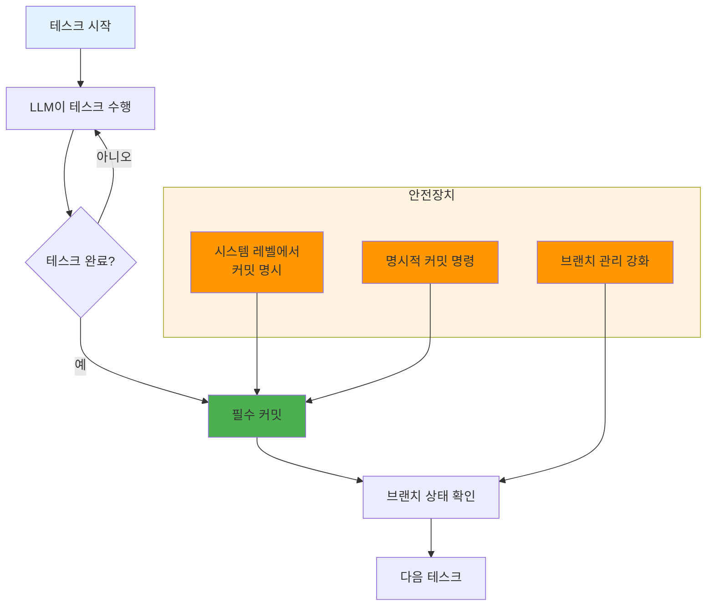
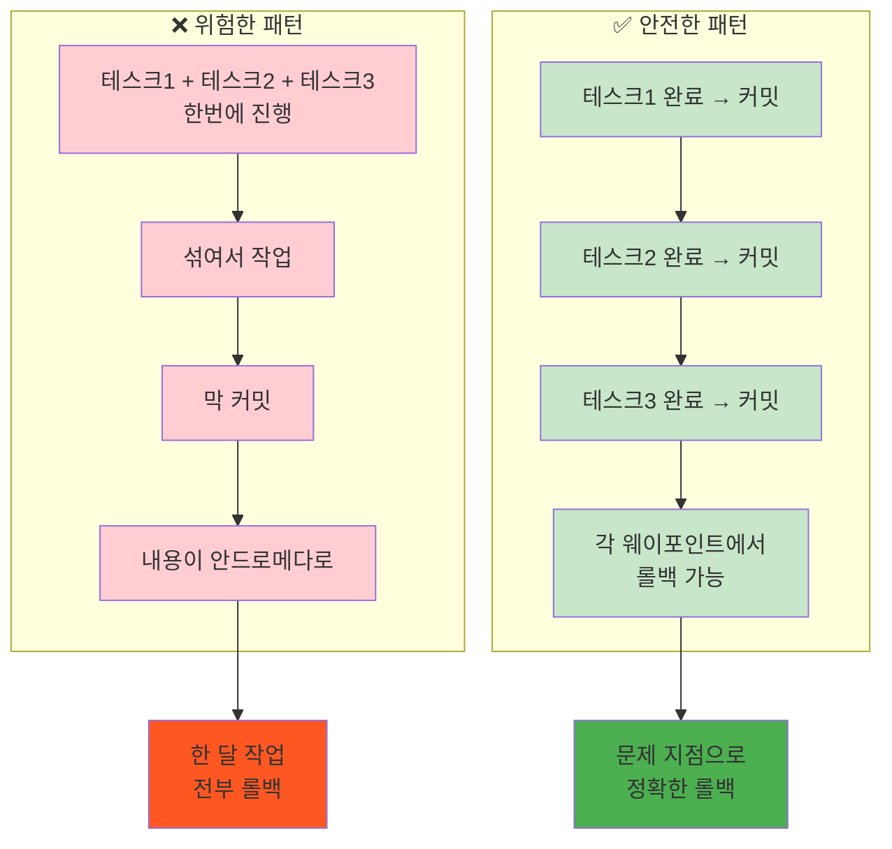
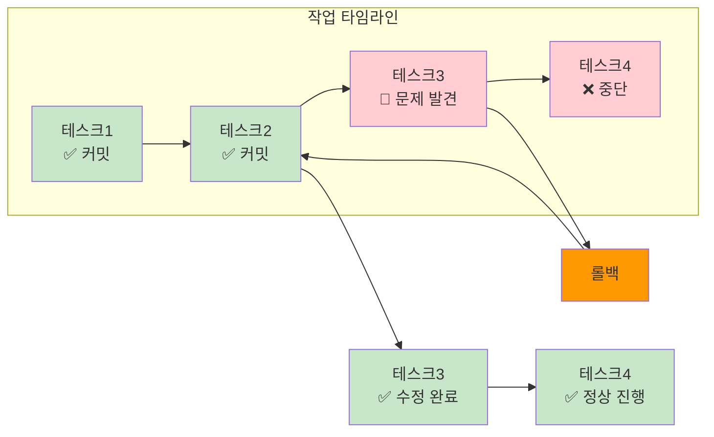

# ROOT-010: 점진적으로 작업하고 롤백 가능하게 하라

## 핵심 포인트

**테스크 단위로 커밋하고 코드를 관리하는 방법을 적용하지 않으면 LLM 기반의 작업에서는 아주 큰일이 날 수 있다.**
LLM이 개발 웨이포인트를 찍지 않고 넘어가게 하면 정말 돌이킬 수 없는 잘못된 길로 갈 가능성이 크기 때문에, 기능에서 테스크 하나가 끝날 때마다 가능하면 커밋해서 롤백을 할 수 있게 해야 한다.

## 경험 스토리

### 문제 상황

바쁘다고 develop 브랜치 안에서 직접 작업할 때가 있었다. 결국 그걸 한 달 하다가 한 달 전부로 롤백해야 했다.

물론 커밋은 하긴 했지만, 이미 브랜치로 나눠놓지 않은 시점에서 내용이 안드로메다로 가버렸더라. 더 큰 문제는 LLM이 하다 보니까 내가 직접 했다면 커밋을 다 해서 나눠놨을 걸 섞여서 작업되어 있는 거였다. 아주 곤란했다.

### 시행착오

처음에는 일반적인 개발처럼 적당히 커밋하면 될 줄 알았다. 하지만 LLM과 함께 작업할 때는 완전히 다른 패턴이었다.

LLM은 사람과 달리 논리적인 단위로 커밋을 나누지 않는다. 그냥 막 개발하고 막 커밋한다. 그래서 나중에 문제가 생겼을 때 어디서 잘못된 건지 찾기가 매우 어려웠다.

### 깨달음의 순간

그때 한 번 데이고 알게 됐다. **"LLM에게는 명시적인 웨이포인트가 절대적으로 필요하다"**는 것을.

LLM이 웨이포인트를 찍지 않고 넘어가게 하면 정말 돌이킬 수 없는 잘못된 길로 갈 가능성이 매우 크다는 걸 뼈저리게 느꼈다.

### 실제 적용

**시스템 레벨에서 테스크 단위 커밋을 명시했다.**

**LLM의 위험한 패턴 vs 안전한 패턴:**

**웨이포인트 시스템:**

**현실적 대응책:**

물론 LLM이다 보니까 항상 지키지는 않는다. 하지만 내가 명시적으로 작업하는 내용을 마치면 커밋하게끔 명령하게 작업하고 있다. 브랜치 관리에 더 신경 쓰고 있고.

**결과적 개선:**

- **문제 지점으로 롤백 가능**: 문제가 생긴 곳으로 정확히 돌아갈 수 있게 됨
- **LLM 미칠 때 대응**: LLM이 가끔 미쳐서 안 돌아가는 코드를 막 커밋해도 롤백 가능
- **시스템 가드의 현실**: 시스템 레벨에서 가드를 많이 달아놨지만 무조건 안전한 건 아님
- **웨이포인트의 가치**: 이런 웨이포인트가 만들어지면 확실히 더 안전함

## 실제 적용 방법

### 인식 신호

다음 신호들이 보이면 점진적 작업과 롤백 시스템이 필요할 때다:

- LLM이 여러 테스크를 섞어서 작업할 때
- 커밋 단위가 논리적이지 않고 뒤섞여 있을 때
- 문제가 생겼을 때 어디서 잘못됐는지 찾기 어려울 때
- 브랜치 없이 develop이나 main에서 직접 작업할 때
- LLM이 안 돌아가는 코드를 막 커밋할 때

### 구체적 적용

#### 1. 테스크 단위 커밋 시스템

**시스템 레벨 규칙:**
- 테스크 하나가 완료되면 반드시 커밋
- 커밋 메시지에 테스크 내용 명시
- 각 커밋은 독립적으로 동작 가능해야 함
- 테스크가 실패하면 이전 커밋으로 롤백

**명시적 커밋 명령:**
- 작업 완료 시 명시적으로 커밋 명령
- LLM이 자동으로 커밋하지 않도록 제어
- 커밋 전 반드시 동작 확인

#### 2. 브랜치 관리 강화

**브랜치 전략:**
- 기능별로 반드시 브랜치 분리
- develop이나 main에서 직접 작업 금지
- 각 테스크별 브랜치 또는 기능별 브랜치 사용

**롤백 전략:**
- 문제 발견 시 즉시 해당 커밋으로 롤백
- 브랜치 단위 롤백 vs 커밋 단위 롤백 선택
- 롤백 후 다시 테스크 단위로 진행

#### 3. 웨이포인트 시스템 구축

**자동화된 웨이포인트:**
- 각 테스크 완료 후 자동 상태 저장
- 테스트 통과 여부 확인 후 커밋
- 실패 시 자동 롤백 메커니즘

**수동 웨이포인트:**
- 중요한 마일스톤에서 수동 체크포인트
- 복잡한 변경 전후 명시적 커밋
- 브랜치 병합 전 최종 확인

### 주의사항

**하지 말아야 할 것들:**

- **큰 단위 작업**: 여러 테스크를 한번에 진행하지 마라
- **브랜치 무시**: develop이나 main에서 직접 작업하지 마라
- **커밋 미루기**: 테스크 완료 후 커밋을 미루지 마라

**해야 할 것들:**

- **작은 단위 분할**: 테스크를 최대한 작은 단위로 분할하라
- **즉시 커밋**: 테스크 완료 즉시 커밋하라
- **상태 확인**: 커밋 전 반드시 동작 상태 확인하라

## 왜 중요한가

이 원리 없이는 LLM과의 협업에서 돌이킬 수 없는 상황이 자주 발생한다.

구체적으로 점진적 작업과 롤백을 하지 않으면:

- **재앙적 손실**: 한 달 작업을 통째로 롤백하는 상황 발생
- **복구 불가능**: 문제 지점을 찾을 수 없어 처음부터 다시 시작
- **섞인 작업**: LLM이 논리적이지 않게 작업을 뒤섞어서 진행
- **불안정한 개발**: 언제 터질지 모르는 시한폭탄 상태
- **개발 스트레스**: 돌이킬 수 없는 실수에 대한 불안감

반면 점진적 작업과 롤백을 적용하면:

- **안전한 실험**: 언제든 되돌릴 수 있다는 확신으로 적극적 개발
- **정확한 복구**: 문제가 생긴 지점으로 정확히 롤백 가능
- **논리적 진행**: 테스크 단위로 체계적인 개발 진행
- **스트레스 감소**: 실수해도 복구 가능하다는 심리적 안정감
- **품질 보장**: 각 단계별 검증을 통한 안정적 코드 품질

결과적으로 LLM을 "실수해도 안전하게 복구 가능한 개발 파트너"로 만들 수 있다. 웨이포인트 시스템을 통해 예측 불가능한 LLM의 행동에도 안전하게 대응할 수 있는 견고한 개발 프로세스가 가능해진다.