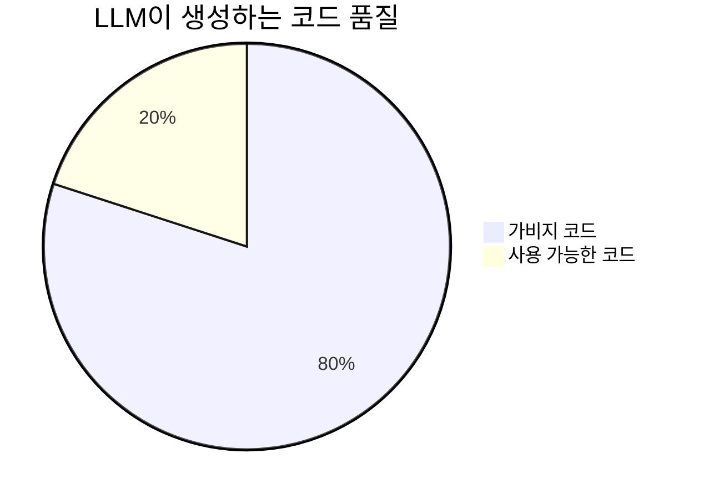
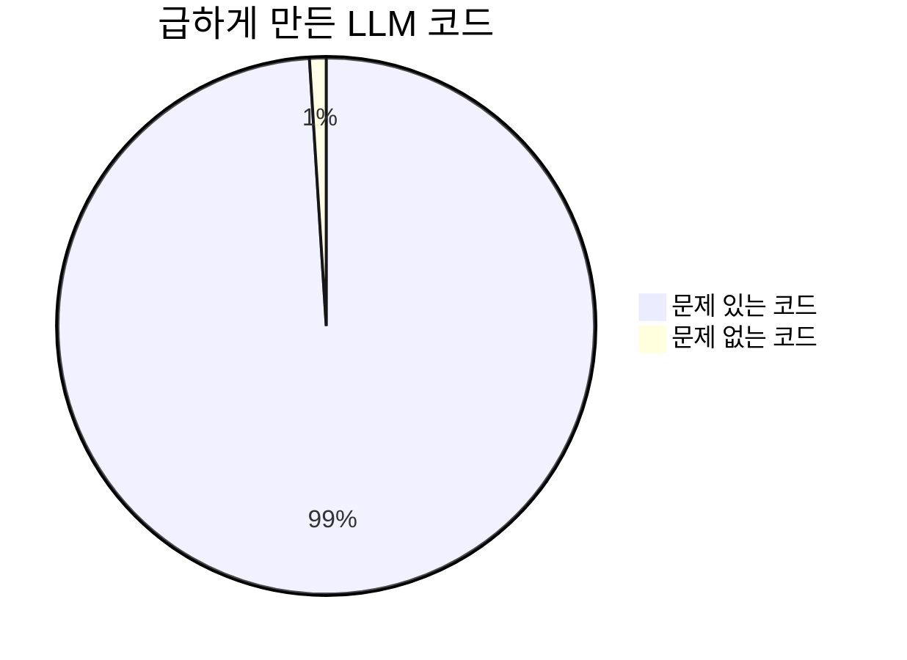
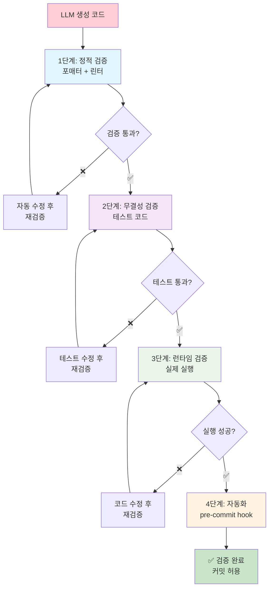

# ROOT-004: 반드시 검증하라

## 핵심 포인트

**LLM이 만드는 코드의 80% 이상은 가비지 코드다.**
특히 급할 때 올린 코드는 99% 문제가 있다. LLM을 믿지 말고 자동화된 검증 시스템을 믿어라. 검증 없이는 컨텍스트 스위칭 지옥에 빠진다.

## 경험 스토리

### 문제 상황

LLM이 작업하는 코드는 원큐에 잘될 수 없다. 80프로 이상 가비지 코드를 만들어낸다. 이런 경우 이걸 잡을 수 있는 두 가지가 명확한 기준과 명확한 검증인데, 검증 부분이 핵심이다.

나는 검증이 습관화되어 있으니까 그런 경우가 많이 없긴 한데, 진짜 시간없을 때 후다닥 올린 코드들이 거의 99퍼센트(...) 문제가 있었다. 이건 진짜 말도 안 되지. 무조건 문제있는 코드라고 보면 된다.

### 시행착오

처음에는 LLM이 만든 코드를 일일이 확인하면서 수정해야 했다. 시간도 10배는 더 걸리고 무엇보다 컨텍스트 스위칭이 문제였다. LLM한테 뭘 맡겨놓으면 그동안은 다른 일을 해야 하는데 자꾸 왔다갔다하면서 그걸 확인해줘야 하잖아.

LLM이 만든 코드는 기본적으로 포맷이 엉망이다. 화이트스페이스도 어마어마하게 들어가고, 이런 코드를 뽑아내는데 LLM은 이런 걸 수정하는 걸 잘못한다. 일일이 말하면서 "이거 고쳐", "저거 고쳐" 하는 작업이 반복됐다.

### 깨달음의 순간

그래서 그 이후로 나는 LLM을 믿지 않는다. 나의 설계와 검증도구를 믿지, LLM은 그냥 될 때까지 피드백을 받아서 되게 하는 코딩 잘못하는 주니어 수준이다.

아직 사실 난 이게 바뀔 거라고 크게 기대하지 않는다. 그냥 빠르게 할 수 있고 내 힘을 아낄 수 있는 게 좋은 거다. 내가 잘 모르는 것도 그래도 주니어 수준으로는 하니까 나는 컨셉만 가지고 검증하면서 결과를 낼 수 있어서 좋은 거고.

### 실제 적용

체계적인 자동화 검증 시스템을 구축했다.

**LLM 코드 품질 현실:**



**시간 압박 시 코드 품질:**



**4단계 검증 체계:**



**핵심 혁신 - 자동 수정 커밋 시스템:**

나는 커밋 명령어를 만들어서 체인지에 대한 커밋을 인공지능이 알아서 하게 되는데, 여기에 검증을 걸어두면 에러를 뿜으면서 커밋이 안 되니까 지가 알아서 커밋이 될 때까지 수정해서 커밋을 완료한다. 개꿀이다.

정적검증과 포매팅 린터를 통해서 오토픽스 가능한 건 오토픽스를 하게 해야 하고, 테스트랑 이런 검증을 깃 프리커밋 훅으로 걸어두면 지가 커밋을 하기 위해 다 수정하고 커밋하기 때문에 내가 일일이 말하면서 코드를 수정해야 하는 작업시간을 상당히 아낄 수 있다.

이걸 자동화시켜놓으면 지가 알아서 하는 거지.

## 실제 적용 방법

### 인식 신호

다음 신호들이 보이면 검증 시스템을 강화해야 할 때다:

- LLM이 만든 코드를 그대로 믿고 써서 문제 발생할 때
- 코드 리뷰 시간이 개발 시간보다 더 오래 걸릴 때
- 컨텍스트 스위칭으로 집중력이 계속 깨질 때
- "급하니까 이번만" 하고 검증 생략했다가 문제 터질 때
- 포맷 엉망인 코드를 계속 수정해줘야 할 때

### 구체적 적용

#### 1. 4단계 검증 체계 구축

**1단계 - 정적 검증:**

- 포매터 (Prettier, Black, gofmt 등)
- 린터 (ESLint, pylint, golangci-lint 등)
- 오토픽스 가능한 것은 자동 수정

**2단계 - 무결성 검증:**

- 단위 테스트 실행
- 통합 테스트 실행
- 코드 커버리지 확인

**3단계 - 런타임 검증:**

- 스크립트 언어: 실제 실행 테스트
- 컴파일 언어: 빌드 성공 확인
- 의존성 충돌 검사

**4단계 - 자동화:**

- git pre-commit hook 설정
- CI/CD 파이프라인 연동
- 자동 수정 및 재커밋

#### 2. 자동 수정 커밋 시스템

**커밋 명령어 만들기:**

```bash
# 예시: LLM이 사용할 커밋 명령어
claude-commit() {
    # pre-commit hook 실행
    # 실패시 자동 수정 시도
    # 성공할 때까지 반복
    # 최종 커밋 완료
}
```

**검증 실패시 자동 대응:**

- 에러 메시지 분석
- 자동 수정 시도
- 재검증 실행
- 성공까지 반복

#### 3. 검증 도구 선택

**언어별 필수 도구:**

- JavaScript/TypeScript: Prettier + ESLint + Jest
- Python: Black + pylint + pytest
- Go: gofmt + golangci-lint + go test
- 기타: 각 언어의 표준 도구 사용

### 주의사항

**하지 말아야 할 것들:**

- **LLM 코드 신뢰**: 99% 문제 있다고 가정하고 시작하라
- **수동 검증**: 일일이 확인하다가 컨텍스트 스위칭 지옥
- **검증 생략**: "급하니까 이번만"은 반드시 문제 일으킨다

**해야 할 것들:**

- **자동화 우선**: 사람이 할 일을 기계가 하게 만들어라
- **현실적 기대**: LLM은 주니어 수준, 완벽해지길 기대하지 마라
- **검증도구 신뢰**: LLM 말고 검증 시스템을 믿어라

## 왜 중요한가

이 원리를 모르면 LLM과의 협업에서 끝없는 디버깅 지옥에 빠진다.

구체적으로 검증하지 않으면:

- **시간 폭증**: 수정 작업이 개발 시간의 10배
- **컨텍스트 스위칭 지옥**: 집중력 계속 깨지면서 효율 급락
- **신뢰도 붕괴**: 99% 문제 있는 코드로 프로젝트 불안정
- **스트레스 증가**: 언제 터질지 모르는 시한폭탄
- **품질 하락**: 급할 때마다 검증 생략하면서 기술부채 누적

반면 검증을 자동화하면:

- **개발 속도 10배 향상**: 컨텍스트 스위칭 없는 집중 개발
- **안정적 품질**: 자동화된 검증으로 일정한 코드 품질 유지
- **스트레스 제거**: "이번엔 될까?" 불안감 완전 해소
- **확장 가능**: 검증 시스템만 갖춰지면 어떤 규모든 대응 가능
- **학습 효과**: LLM이 검증 통과를 위해 스스로 학습

결과적으로 LLM을 "검증 통과할 때까지 자동으로 수정하는 시스템"으로 만들 수 있다. 사람은 컨셉만 제공하고 나머지는 자동화된 품질 보장 시스템이 처리하는 효율적인 개발이 가능해진다.
