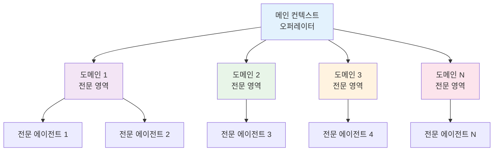
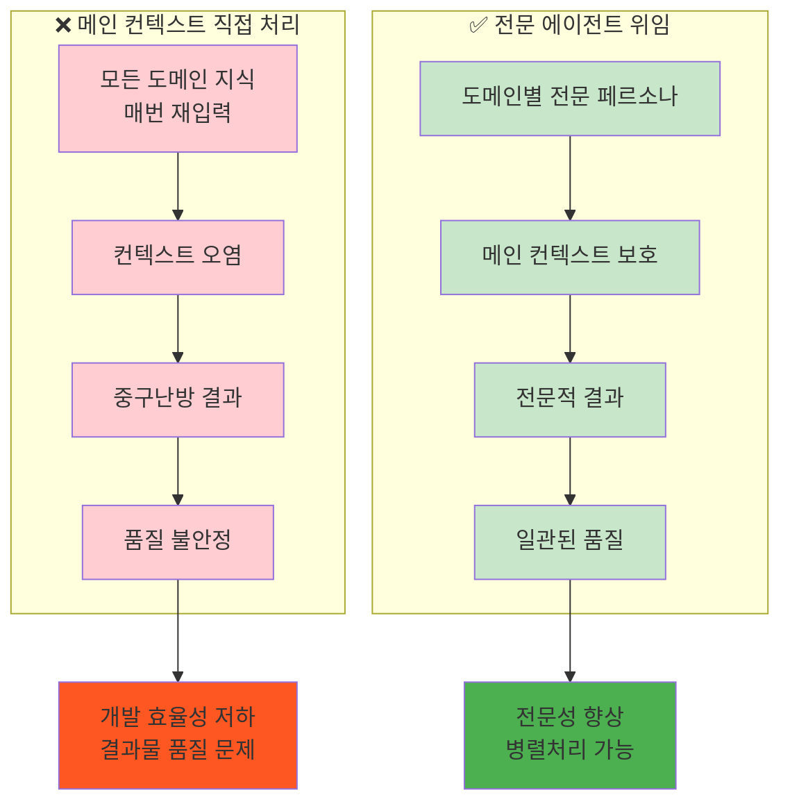
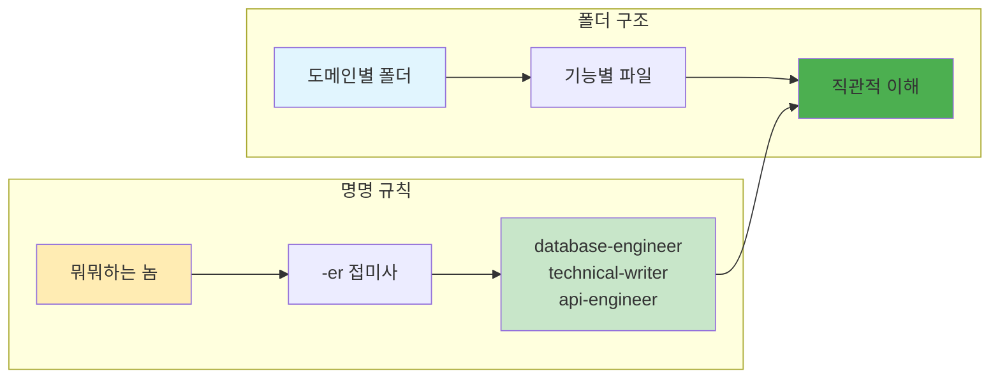

# ROOT-011: 전문 영역은 에이전트에게 위임하라

## 핵심 포인트

**메인 컨텍스트에서 구현이나 설계 등 특정 영역 혹은 도메인 집중적인 부분을 직접 하기보다는, 페르소나가 정의된 에이전트 프롬프트를 사용하면 훨씬 좋은 결과를 얻을 수 있다.**
서브에이전트 형태로 작업하면 메인 컨텍스트 오염 방지, 병렬처리, 반복 입력 제거, 품질 향상 등 다양한 이점을 얻을 수 있다.

## 경험 스토리

### 문제 상황

메인 컨텍스트에서 모든 것을 직접 처리하려고 했다. 데이터베이스 설계도 메인에서, 프론트엔드 구현도 메인에서, 문서 작성도 메인에서 모두 처리했다.

특정 도메인에 특화된 작업을 할 때마다 관련 지식을 매번 다시 입력해야 했고, 메인 컨텍스트가 점점 복잡해지면서 품질이 떨어지기 시작했다.

### 시행착오

처음에는 하나의 LLM으로 모든 걸 다 할 수 있을 줄 알았다. "어차피 다 똑똑한 LLM이니까 뭐든 잘할 거야"라고 생각했다.

하지만 막상 복잡한 프로젝트를 진행하다 보니 각 영역마다 필요한 전문 지식과 접근 방식이 달랐다. 메인 컨텍스트에 모든 걸 때려넣으니 중구난방인 결과가 나왔다.

### 깨달음의 순간

핵심 깨달음은 **"전문가는 전문가답게 써야 한다"**는 것이었다.

각 도메인에 특화된 페르소나를 가진 에이전트를 만들어서 사용하니, 같은 LLM이라도 훨씬 전문적이고 일관된 결과가 나왔다. 마치 전문가 팀을 꾸린 것 같은 효과였다.

### 실제 적용

**도메인별 에이전트 시스템을 구축했다:**

**메인 vs 에이전트 비교:**

**명명 규칙과 구조:**

**핵심 장점들:**

- **컨텍스트 효율화**: 컨텍스트 낭비가 많이 줄어듦
- **전문성 향상**: 결과가 더 전문적으로 나오게 됨  
- **품질 안정화**: 중구난방인 걸 상당히 해결할 수 있었음
- **병렬처리**: 클로드코드 한정이긴 하지만 병렬처리도 가능
- **반복 제거**: 도메인 종속적 내용을 매번 입력할 필요 없음

## 실제 적용 방법

### 인식 신호

다음 신호들이 보이면 전문 에이전트 위임이 필요할 때다:

- 메인 컨텍스트에서 특정 도메인 작업을 직접 할 때
- 같은 전문 지식을 매번 다시 입력해야 할 때
- 결과물이 중구난방이고 품질이 불안정할 때
- 여러 도메인이 섞여서 복잡해질 때
- 병렬로 처리할 수 있는 독립적인 작업들이 있을 때

### 구체적 적용

#### 1. 도메인별 에이전트 설계

**도메인 분류 원칙:**

- 명확한 책임 영역을 가진 도메인별 분류
- 각 도메인 내에서도 기능별 세분화
- 중복 없는 명확한 경계 설정

**명명 규칙:**

- 역할 중심: "뭐뭐하는 놈" 개념
- 일관된 접미사 사용
- 직관적 이해: 이름만 보고도 역할 파악 가능

#### 2. 에이전트별 전문성 정의

**페르소나 설계:**

- 명확한 역할 정의 (Role)
- 구체적 전문성 명시 (Expertise)
- 작업 방식과 성격 (Personality)
- 책임 영역과 경계 (Boundaries)

**컨텍스트 최적화:**

- 해당 도메인에 특화된 지식만 포함
- 불필요한 정보는 제거
- 자주 사용하는 패턴과 도구 미리 정의

#### 3. 메인-에이전트 협업 체계

**위임 전략:**

- 메인은 전체 조율과 의사결정
- 에이전트는 전문 영역 실행
- 결과물은 메인으로 다시 통합

**병렬 처리:**

- 독립적인 작업은 여러 에이전트에 동시 위임
- 의존성 있는 작업은 순차적 진행
- 결과물 동기화 및 통합 관리

### 주의사항

**하지 말아야 할 것들:**

- **과도한 분할**: 너무 세분화해서 관리 비용 증가시키지 마라
- **중복 에이전트**: 비슷한 역할의 에이전트 중복 생성하지 마라
- **명명 혼란**: 일관성 없는 명명으로 혼란 야기하지 마라

**해야 할 것들:**

- **명확한 경계**: 각 에이전트의 책임 범위를 명확히 정의하라
- **전문성 집중**: 해당 도메인에만 특화된 에이전트 만들라
- **지속적 개선**: 사용하면서 에이전트 성능을 지속적으로 개선하라

## 왜 중요한가

이 원리 없이는 LLM의 전문성을 제대로 활용할 수 없고 품질 저하가 불가피하다.

구체적으로 전문 에이전트를 사용하지 않으면:

- **컨텍스트 낭비**: 매번 도메인 지식을 다시 입력해야 함
- **품질 불안정**: 전문성 부족으로 중구난방인 결과물
- **효율성 저하**: 병렬처리 불가능으로 개발 속도 저하
- **메인 오염**: 메인 컨텍스트가 복잡해져서 전체 품질 저하
- **확장성 한계**: 복잡한 프로젝트에서 관리 불가능

반면 전문 에이전트를 활용하면:

- **컨텍스트 효율화**: 필요한 전문 지식만 정확히 활용
- **전문성 극대화**: 각 도메인별 최적화된 결과물
- **병렬 처리**: 동시에 여러 작업 진행으로 속도 향상
- **메인 보호**: 메인 컨텍스트를 깨끗하게 유지
- **확장성 확보**: 도메인 추가 시 해당 에이전트만 추가

결과적으로 LLM을 "전문가 팀"으로 만들 수 있다. 각 영역의 전문성을 극대화하면서도 전체적인 협업이 가능한 효율적인 개발 시스템이 구축된다.
