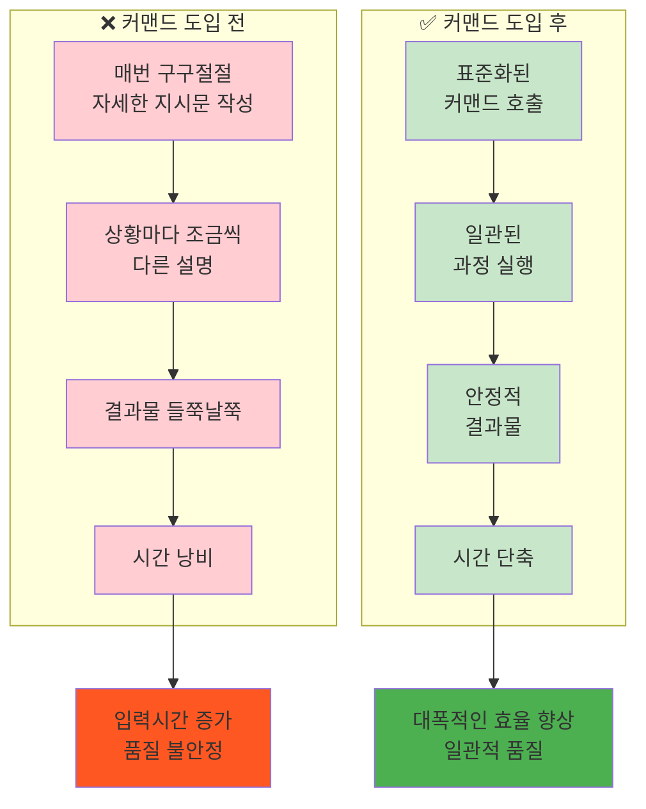
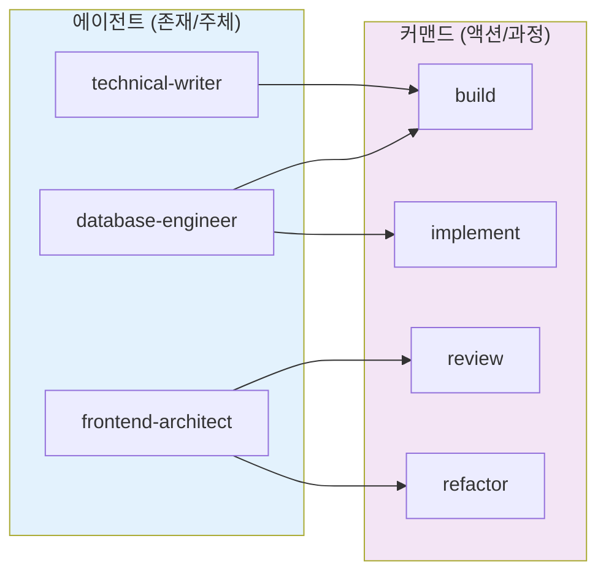
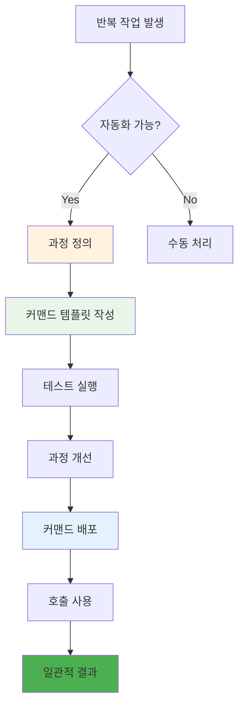

# ROOT-012: 반복적인 작업은 커맨드를 만들어서 관리하라

## 핵심 포인트

**자동화가 가능한 과정은 프롬프트로 만들어서 관리해야 한다.**
에이전트는 존재(주체)이고, 커맨드는 액션(과정)이다. "어떤 과정을 할지" 정의해놓고 필요할 때마다 호출함으로써 업무 일관성과 결과물 안정성을 비약적으로 높일 수 있다.

## 경험 스토리

### 문제 상황

매번 반복적인 작업을 할 때마다 구구절절 자세하게 적어야 했다. "뭐하면 뭘 어떻게해서 뭘 참고하고 이리이리해줘" 이런 식으로 길고 복잡한 지시를 반복해야 했다.

같은 종류의 작업인데도 매번 조금씩 다르게 설명하다 보니 결과물도 들쭉날쭉했다. 특히 커밋, PR, 리팩토링, 리뷰 같은 입력출력이 명확한 작업들에서도 일관성이 없었다.

### 시행착오

처음에는 복사-붙여넣기로 해결하려고 했다. 이전에 잘 된 지시문을 복사해서 재사용하려고 했는데, 상황마다 조금씩 달라서 결국 매번 수정해야 했다.

템플릿으로 관리하려고도 해봤지만, 단순한 템플릿으로는 복잡한 과정을 표준화하기 어려웠다. 결국 또 매번 수동으로 조정해야 하는 상황이 반복됐다.

### 깨달음의 순간

핵심 깨달음은 **"과정 자체를 자동화해야 한다"**는 것이었다.

에이전트는 "누가 할 것인가"의 문제이고, 커맨드는 "어떻게 할 것인가"의 문제라는 걸 깨달았다. 반복적인 과정을 프롬프트로 정의해놓으면, 매번 같은 품질의 결과를 얻을 수 있다는 것을 발견했다.

### 실제 적용

**커맨드 기반 자동화 시스템을 구축했다:**

**에이전트 vs 커맨드:**

**반복 작업 자동화 과정:**

**핵심 개선 결과:**

- **입력시간 대폭 단축**: 매번 구구절절 적을 필요 없음
- **결과물 일관성**: 커맨드 내용이 일관적이니까 결과물도 의도한 대로 일관적으로 나옴  
- **반복작업 최적화**: 커밋, PR, 리팩토링, 리뷰 등 입력출력이 명확한 반복작업들에서 어마어마한 개선

## 실제 적용 방법

### 인식 신호

다음 신호들이 보이면 커맨드 자동화가 필요할 때다:

- 같은 종류의 작업을 반복적으로 수행할 때
- 매번 길고 복잡한 지시문을 작성해야 할 때  
- 결과물의 일관성이 떨어질 때
- 입력출력이 명확한 작업들이 있을 때
- 과정이 정형화되어 있지만 수동으로 하고 있을 때

### 구체적 적용

#### 1. 자동화 대상 식별

**자동화하기 좋은 작업들:**
- 입력출력이 명확한 작업 (커밋, PR, 리뷰)
- 정형화된 과정을 가진 작업 (문서 생성, 코드 리팩토링)
- 반복 빈도가 높은 작업
- 품질 일관성이 중요한 작업

**자동화하기 어려운 작업들:**
- 창의적 사고가 필요한 작업
- 상황별 판단이 크게 달라지는 작업
- 한 번성 작업들

#### 2. 커맨드 설계 원칙

**과정 정의:**
- 명확한 입력 요구사항
- 단계별 실행 과정
- 예상 출력 형태
- 품질 검증 기준

**재사용성 고려:**
- 상황별 변수 처리
- 옵션과 파라미터 설계
- 에러 처리와 예외 상황
- 확장 가능한 구조

#### 3. 품질 보장 시스템

**일관성 확보:**
- 표준화된 과정 문서화
- 결과물 검증 체크리스트
- 피드백 루프를 통한 지속 개선

**효율성 측정:**
- 시간 단축 효과 측정
- 품질 향상 지표 추적
- 사용 빈도와 만족도 모니터링

### 주의사항

**하지 말아야 할 것들:**

- **과도한 자동화**: 모든 것을 자동화하려고 하지 마라
- **복잡한 커맨드**: 너무 복잡한 과정을 하나의 커맨드로 만들지 마라
- **유지보수 무시**: 만들어놓고 관리하지 않으면 오히려 방해가 된다

**해야 할 것들:**

- **점진적 도입**: 간단한 것부터 시작해서 점차 확장하라
- **지속적 개선**: 사용하면서 계속 개선하고 최적화하라  
- **문서화**: 커맨드 사용법과 목적을 명확히 문서화하라

## 왜 중요한가

이 원리 없이는 반복 작업에서 계속 시간을 낭비하고 품질 불일치가 발생한다.

구체적으로 커맨드 자동화를 하지 않으면:

- **시간 낭비**: 매번 같은 지시문을 길게 작성해야 함
- **품질 불일치**: 상황마다 다른 설명으로 결과물이 들쭉날쭉
- **피로도 증가**: 반복적인 입력 작업으로 인한 스트레스
- **실수 증가**: 수동 작업에서 발생하는 누락과 오류
- **확장성 제한**: 작업량이 늘어날수록 관리 불가능

반면 커맨드 자동화를 적용하면:

- **시간 효율성**: 입력시간 대폭 단축으로 핵심 작업에 집중
- **품질 일관성**: 표준화된 과정으로 안정적이고 일관된 결과물
- **작업 효율**: 반복 작업 자동화로 생산성 극대화
- **실수 감소**: 정형화된 과정으로 누락과 오류 최소화
- **확장성**: 작업량 증가에도 안정적 대응 가능

결과적으로 LLM을 "표준화된 과정을 안정적으로 실행하는 시스템"으로 만들 수 있다. 반복적인 업무는 자동화하고 창의적인 업무에 집중할 수 있는 효율적인 작업 환경이 구축된다.